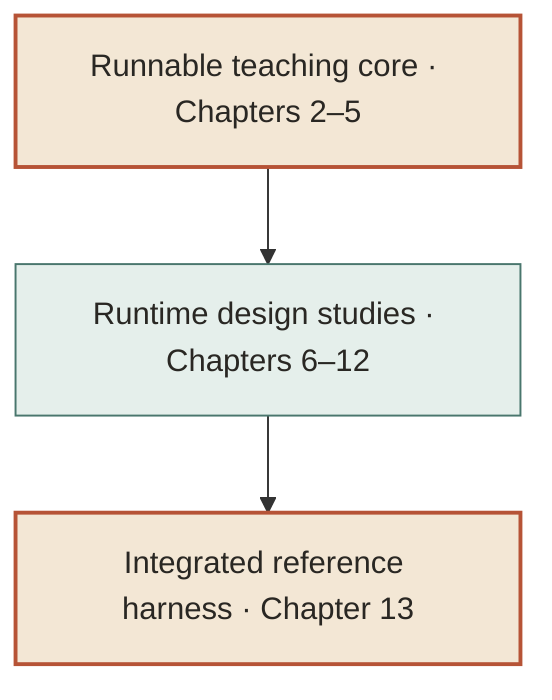

# Building a Coding Agent Harness

## Front Matter

---

**Title:** Building a Coding Agent Harness

**Subtitle:** From Model Calls to a Safe, Observable, Evaluable Runtime

**Supporting line:** A practical systems guide built with Rust and proven through Quecto

**Authors:** Aditya Karnam and Arjun Jaggi

**Edition:** 1.0.0

**Published:** October 2026

**License:** MIT

---

## Preface

> **You will not learn much by reading this book about models.** You will learn a great deal by reading it about harnesses.

The model gives the agent its raw capability, but the harness shapes its behavior, safety, traceability, and cost. A well-designed harness can help a smaller model succeed by constraining the search space effectively. A poorly designed harness can make a capable model produce worse results than a smaller model operating with clear guardrails.

This book teaches you to build a harness, not to study models. You will not train a single model in these pages. What you will train is judgment — about where to draw boundaries, what to gate, what to observe, and what to measure.

The writing assumes you know programming and basic computer science but might not know agent-system architecture. You will build along in Rust. The runnable reference crate develops the model boundary, agent loop, tools, repository context, and policy. Later chapters widen the lens to the additional runtime concerns implemented in production Quecto; those chapters are architecture studies, not claims that every layer is implemented in the compact teaching crate.

This book is not documentation of one repository. It is a general guide to harness design, using Rust for implementation and Quecto as evidence that the architecture works.

## How to Use This Book

Read Chapters 1–5 sequentially; these build the runnable reference crate. Chapters 6–12 examine production-runtime concerns, marking their exercises as design extensions when the teaching crate does not implement them. Chapter 13 brings the implemented core together and Appendix A maps the broader design to production Quecto.

The book uses a build-first rhythm:

1. State the system problem.
2. Define the invariant the harness must preserve.
3. Introduce the smallest workable design.
4. Add code to the shared reference implementation.
5. Demonstrate a realistic failure mode.
6. Compare the teaching design with production Quecto.
7. End with a focused exercise or design question.

Callouts appear throughout:

- **System invariant** — the property that must remain true.
- **Failure mode** — how a plausible implementation breaks.
- **Quecto in production** — how the real project handles the concern.
- **Beyond Rust** — how the boundary maps to other ecosystems.
- **Build checkpoint** — what the reader can run at this stage.

Prerequisites: Rust 2021, a Unix terminal, familiarity with HTTP and basic system programming. Python or TypeScript familiarity is helpful but not required.

## Architecture Map (Summary)

The system can be understood as cooperating concerns. The first five are implemented in the teaching crate; the later runtime concerns are developed as designs and compared with Quecto:

| Layer | Purpose | Chapter |
|-------|---------|---------|
| Model transport | Reach a model provider | 2 |
| Agent loop | Reason through steps safely | 3 |
| Tools | Typed communication | 4 |
| Policy | Gate reads, edits, commands | 5 |
| Verification | Confirm before finishing | 6 |
| Context | Resolve repository paths safely | 7 |
| Runtime architecture | Instructions, sessions, flavors, MCP, telemetry, evaluation | 8–12 |
| Reference harness | Assemble the runnable teaching core | 13 |

The map below is conceptual. The runnable crate has no modules for verification retries, persisted sessions, flavors, MCP, telemetry, or evaluation.

## How This Book Is Structured

The book is divided into four parts:

**Part I — Build the smallest useful core (Chapters 1–3):** Model transport and the agent loop.

**Part II — Add tools and safety boundaries (Chapters 4–7):** Typed tools, policy, verification concepts, and repository context.

**Part III — Turn a loop into a runtime (Chapters 8–11):** Sessions, profiles, MCP, and observability.

**Part IV — Know whether it works (Chapters 12–13):** Evaluation, final assembly.

## Notes

- Code excerpts are drawn from the reference implementation. Long listings are in the source; short excerpts appear inline.
- The production comparison (Quecto) links to the repository. Source paths and the pinned revision are listed in Appendix A.
- "Beyond Rust" notes map interfaces to Python, TypeScript, and Go without creating parallel implementations.

---

*This book is released under the MIT License. The reference implementation uses `serde`, `serde_json`, `ureq`, and `tempfile`.*
