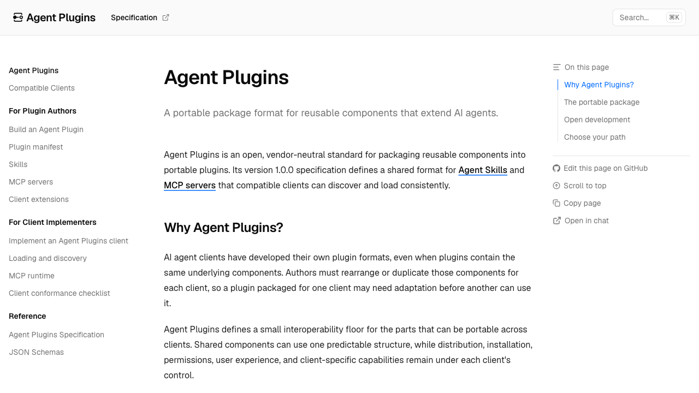

_A read-through of the [Agent Plugins v1.0.0 specification](https://agent-plugins.org/specification) from the perspective of someone who already maintains plugins that ship two manifests to do one job._

I publish a plugin called [subagent-fleet](/subagent-fleet-local-ai-compute-control-plane). It contains exactly three skills and nothing else — no hooks, no commands, no MCP servers. Three directories with a `SKILL.md` in each.

To make those three directories loadable in two different clients, the package ships two manifests:

```text
plugins/subagent-fleet/
├── .claude-plugin/plugin.json
├── .codex-plugin/plugin.json
└── skills/
    ├── subagent-fleet-bootstrap/
    ├── subagent-fleet-operations/
    └── subagent-fleet-setup/
```

The two files describe the same package. They disagree on where the manifest lives, whether skills need to be declared (`"skills": "./skills/"` in one, implicit in the other), and what optional metadata is allowed. Nothing about my plugin is client-specific. The packaging is.

That is the problem [Agent Plugins](https://agent-plugins.org/) targets, and on **August 6, 2026** the group behind it published version 1.0.0.



## What actually shipped

The deliverable is small and unusually disciplined: a normative specification document, two JSON Schemas, a documentation site, and a copyable example package. That is it. No runtime, no CLI, no registry.

The proposal was initiated by Vercel and refined with representatives from AWS, Anysphere (Cursor), GitHub, Microsoft, OpenAI, and Vercel. The Technical Steering Committee named in [`MAINTAINERS.md`](https://github.com/agentplugins/agent-plugins-spec/blob/main/MAINTAINERS.md) is five people — Clare Liguori (Amazon), Roshan Sadanani (Cursor), Harald Kirschner (Microsoft), Gav Verma (OpenAI), and Jonathan Hefner (Vercel, lead). Google [announced the same day](https://developers.googleblog.com/agent-plugins-package-your-skills-tools-and-more/) that it is joining as a Core Maintainer, represented by Kevin Hou, and is shipping support in its Agents CLI and Data Agent Kit.

The [compatible clients page](https://agent-plugins.org/compatible-clients) currently lists seven: GitHub Copilot, ChatGPT & Codex, VS Code, Hermes Agent, Kiro, Cursor, and OpenClaw. All seven support Agent Skills and MCP; they differ only in which MCP transports they accept.

Claude Code is not on that list as I write this. That is worth naming plainly, because the spec's skill format is [Agent Skills](https://agentskills.io/specification) — the format Anthropic originated and which everyone here adopted wholesale. The skills half of this standard is already the de facto Claude Code format. It is the *packaging* half that has not converged.

## The portable core is three things

The entire v1 format fits in a paragraph. A plugin is a directory. It must contain `plugin.json` at the root. It may contain a `skills/` directory whose immediate children each hold a `SKILL.md`. It may contain an `mcp.json` at the root. Anything else a client wants lives under a reverse-domain directory that other clients ignore.

<svg viewBox="0 0 900 400" xmlns="http://www.w3.org/2000/svg" role="img" aria-labelledby="apLayoutTitle apLayoutDesc" fontFamily="'JetBrains Mono','Fira Code',Consolas,monospace" style={{width: "100%", height: "auto"}}>
  <title id="apLayoutTitle">Agent Plugins v1 package layout</title>
  <desc id="apLayoutDesc">A plugin root directory splits into two zones. The portable zone, which every conformant client must understand, contains plugin.json (required manifest), skills slash (Agent Skills, discovered one level deep), and mcp.json (MCP server configuration). The client-owned zone contains reverse-domain extension directories such as com.example.client, holding hooks, commands, and agents, which clients that do not own the namespace must ignore.</desc>
  <rect x="0" y="0" width="900" height="400" fill="#FAF9F7"/>

  <text x="20" y="28" fontSize="12" letterSpacing="0.08em" fill="#C2522D" fontWeight="700">PORTABLE — EVERY CONFORMANT CLIENT READS THESE</text>
  <line x1="20" y1="40" x2="880" y2="40" stroke="#D8D4CC" strokeWidth="1"/>

  <rect x="20" y="58" width="270" height="96" rx="10" fill="#FFFFFF" stroke="#D8D4CC" strokeWidth="2"/>
  <text x="36" y="84" fontSize="13" fill="#1A1A18" fontWeight="700">plugin.json</text>
  <text x="36" y="104" fontSize="10" fill="#6B6B63">REQUIRED · closed schema</text>
  <text x="36" y="122" fontSize="10" fill="#6B6B63">$schema + name are mandatory</text>
  <text x="36" y="140" fontSize="10" fill="#6B6B63">no component config allowed</text>

  <rect x="315" y="58" width="270" height="96" rx="10" fill="#F2F0EC" stroke="#D8D4CC"/>
  <text x="331" y="84" fontSize="13" fill="#1A1A18" fontWeight="700">skills/</text>
  <text x="331" y="104" fontSize="10" fill="#6B6B63">OPTIONAL · fixed location</text>
  <text x="331" y="122" fontSize="10" fill="#6B6B63">each child dir with SKILL.md</text>
  <text x="331" y="140" fontSize="10" fill="#6B6B63">one level deep, no recursion</text>

  <rect x="610" y="58" width="270" height="96" rx="10" fill="#F2F0EC" stroke="#D8D4CC"/>
  <text x="626" y="84" fontSize="13" fill="#1A1A18" fontWeight="700">mcp.json</text>
  <text x="626" y="104" fontSize="10" fill="#6B6B63">OPTIONAL · fixed location</text>
  <text x="626" y="122" fontSize="10" fill="#6B6B63">stdio / streamable-http / sse</text>
  <text x="626" y="140" fontSize="10" fill="#6B6B63">closed union per server entry</text>

  <text x="20" y="212" fontSize="12" letterSpacing="0.08em" fill="#C2522D" fontWeight="700">CLIENT-OWNED — IGNORED BY CLIENTS THAT DO NOT OWN THE NAMESPACE</text>
  <line x1="20" y1="224" x2="880" y2="224" stroke="#D8D4CC" strokeWidth="1"/>

  <rect x="20" y="242" width="410" height="120" rx="10" fill="#F2F0EC" stroke="#D8D4CC" strokeDasharray="5 4"/>
  <text x="36" y="268" fontSize="13" fill="#1A1A18" fontWeight="700">com.example.client/</text>
  <text x="36" y="288" fontSize="10" fill="#6B6B63">extension directory — reverse domain</text>
  <text x="36" y="310" fontSize="10" fill="#6B6B63">hooks/ · commands/ · agents/ · lsp/</text>
  <text x="36" y="332" fontSize="10" fill="#6B6B63">contents defined entirely by that client</text>
  <text x="36" y="352" fontSize="10" fill="#6B6B63">spec assigns it no meaning</text>

  <rect x="455" y="242" width="425" height="120" rx="10" fill="#F2F0EC" stroke="#D8D4CC" strokeDasharray="5 4"/>
  <text x="471" y="268" fontSize="13" fill="#1A1A18" fontWeight="700">"extensions" in plugin.json</text>
  <text x="471" y="288" fontSize="10" fill="#6B6B63">the only place client fields may appear</text>
  <text x="471" y="310" fontSize="10" fill="#6B6B63">keyed by the same reverse-domain name</text>
  <text x="471" y="332" fontSize="10" fill="#6B6B63">unimplemented namespaces are not validated</text>
  <text x="471" y="352" fontSize="10" fill="#6B6B63">a client may use files, manifest data, or both</text>
</svg>

The smallest conformant plugin is two lines of JSON:

```json
{
  "$schema": "https://agent-plugins.org/schemas/1.0.0/plugin.schema.json",
  "name": "minimal-plugin"
}
```

`$schema` and `name` are the only required fields. Everything else — `version`, `description`, `author`, `homepage`, `repository`, `license`, `keywords`, `extensions` — is optional metadata.

## The design decisions worth reading twice

Most of this spec is boring on purpose. A handful of choices are not, and they are the ones that will decide whether clients actually converge.

**The manifest is closed and cannot configure components.** Only those ten top-level fields are permitted. You cannot put `hooks`, `agents`, `commands`, `mcpServers`, or `lspServers` at the top level of `plugin.json`, and you cannot use the manifest to point skills somewhere other than `skills/`. Component locations are fixed and non-overridable. This kills an entire category of divergence: no client needs to implement discovery indirection or source-precedence rules, because there is only ever one place to look.

The failure handling here is well judged. An unknown top-level field is a schema violation, but clients must **report and ignore** it and keep loading — not reject the plugin. Any *other* schema violation is fatal. That split gives you strict validation and typo detection without one stray key bricking an otherwise valid package.

**`$schema` is required, and clients must not fetch it.** The value is a canonical identifier — `https://agent-plugins.org/schemas/1.0.0/plugin.schema.json` — used purely to select locally supported validation rules. Loading a plugin must never make a network request. Small rule, large consequence: plugin loading stays offline, deterministic, and free of a supply-chain hop that would otherwise sit in the hot path of every install.

**Path containment is normative, and the failure boundaries are graded.** Every plugin-supplied path must resolve inside the plugin root after symlink resolution. Plugin-relative fields must literally begin with `./`. But the spec does not simply say "reject on violation" — it enumerates the narrowest boundary for each case: a bad `plugin.json` rejects the plugin, a bad `SKILL.md` skips that skill, a bad MCP `command` or `cwd` invalidates that one server entry. Everything else keeps loading.

That graded-failure principle runs through the whole document, and it is the part I would most want other specs to copy. A plugin shipping four skills and one MCP server should not become unusable because the server can't authenticate. §11.3 says explicitly that it must not.

**`PLUGIN_ROOT` and `PLUGIN_DATA` are the entire runtime contract.** Any client launching a stdio MCP server must set both environment variables and must expand `${PLUGIN_ROOT}` and `${PLUGIN_DATA}` in `args`, `env`, and `cwd`. `PLUGIN_ROOT` is the package. `PLUGIN_DATA` is a client-managed writable directory that must survive plugin updates — the place for `node_modules`, virtualenvs, caches, generated code.

```json
{
  "$schema": "https://agent-plugins.org/schemas/1.0.0/mcp.schema.json",
  "mcpServers": {
    "local-validator": {
      "type": "stdio",
      "command": "./bin/validator",
      "args": ["--data", "${PLUGIN_DATA}/validator"],
      "env": { "CONFIG": "${PLUGIN_ROOT}/config.json" },
      "cwd": "${PLUGIN_ROOT}"
    }
  }
}
```

Expansion is a single non-recursive textual pass, and text introduced by a replacement is never rescanned. No other variables expand. Unrecognized `${...}` text stays literal. This is the correct amount of templating — enough to write an absolute path you don't know at authoring time, not enough to become a language.

Having [run an MCP server as a portfolio interface](/portfolio-mcp-server), the `PLUGIN_DATA` guarantee is the part I would have wanted most: a writable directory the client promises to preserve across updates removes the awkward question of where a server is allowed to keep its own state.

**`command` is one token, never a shell string.** It is either a bare executable name resolved by platform search rules, or a plugin-relative `./` path. No interpolation. If you bundle a binary, you must use the relative form. The spec is candid that bare-name resolution differs across clients and tells conforming plugins not to depend on it.

**`streamable-http` and `sse` are distinct declared transports, with no fallback.** Each server entry states its transport and the client uses that for the initial attempt. `sse` means specifically the deprecated MCP 2024-11-05 HTTP+SSE transport, not SSE responses inside Streamable HTTP — a distinction current client configs routinely blur. Clients must support at least one of stdio or Streamable HTTP; `sse` is optional.

**Headers and `env` are explicitly not a secret mechanism.** The spec states outright that both are visible package data and that plugins must not embed credentials in either. There is no portable OAuth or credential-reference field in v1. Authorization is entirely client-managed, and an auth failure is a connection failure — not invalid configuration.

## What does v1 deliberately leave out?

Two component types. Skills and MCP servers. That's the whole surface.

Hooks, commands, subagents, rules, LSP servers — all excluded, with a stated reason: their formats are still too client-specific for a stable portable contract. Skills and MCP made the cut because both have established specs maintained outside this project and real cross-client adoption already.

I think that is the right call and it is also the part that will frustrate people most. If you maintain a Claude Code plugin built around hooks and slash commands, v1 standardizes almost none of it. Looking across the plugins I have installed locally, the ones that are skills-only port cleanly; the ones carrying `hooks/`, `commands/`, and `agents/` directories carry most of their weight in exactly the parts the spec declines to standardize. Those keep living under a `com.vendor.client/` directory — portable in the sense that other clients won't choke on them, not in the sense that they'll work.

[`FUTURE_CONSIDERATIONS.md`](https://github.com/agentplugins/agent-plugins-spec/blob/main/FUTURE_CONSIDERATIONS.md) is refreshingly honest about the rest of the gap. v1.0.0 defines no trust model, no permission declarations, no sandboxing, no signature or provenance verification, no secrets handling, no enterprise allowlists, no audit event schema, no inter-plugin dependencies, and no conformance test suite. Every one of those is listed as "may define" in a future version, with nothing committed.

That is a real gap, not a footnote. A format that makes it one step easier to install a directory containing an executable and an MCP server config, while explicitly deferring provenance and permissions, has moved the distribution problem forward and the trust problem sideways. The spec doesn't pretend otherwise, which is better than most standards manage — but "clients handle it" is doing heavy lifting in the meantime.

## How do you migrate an existing plugin?

The [example repository](https://github.com/agentplugins/agent-plugins-example) is the practical artifact here, and it ships a `migrate-agent-plugin` skill that encodes the workflow. The sequence it recommends:

1. Add and validate a root `plugin.json` **without deleting** anything that currently works.
2. Move or copy reusable skills into `skills/<skill-name>/SKILL.md`.
3. Convert portable MCP servers into root `mcp.json` with explicit `type` fields.
4. Move hooks, commands, agents, LSP config, and marketplace metadata into a client extension namespace or a separate compatibility package.
5. Test the portable core *and* every client package before removing legacy files.

For subagent-fleet, steps 1 and 2 are the whole job — `skills/` is already in the right place with the right layout, so I add a root `plugin.json` and the portable core is done. The two vendor manifests stay until the clients that read them adopt the spec. That is the honest state of migration right now: you add a third manifest before you get to delete the first two.

Nothing about the migration is reversible-hostile, which matters. The additive path means a package can be simultaneously a valid Agent Plugin and a valid client-native plugin for as long as it needs to be.

## What I'm watching

Three things will tell us whether this held.

**Whether a second client-owned extension namespace ever becomes portable.** The clean test of whether §8 is a bridge or a permanent parking lot is whether hooks or commands get promoted into v2's portable core. If reverse-domain directories are still where every interesting capability lives in a year, the spec standardized the easy 20%.

**Whether the trust model arrives before the incident does.** Provenance verification and permission declarations are both in the "future considerations" pile while the install path gets smoother. Standards usually get their security model after they need one.

**Whether Claude Code adopts it.** Agent Skills is Anthropic's format and it is the skill half of this spec verbatim. Seven clients ship the packaging half already. The gap between those two facts is the single most interesting open question in the ecosystem right now, and it is the one I'll be checking on.

For a spec written by five companies with competing products, v1.0.0 is remarkably restrained. It standardizes the parts that were genuinely the same everywhere, refuses to standardize the parts that weren't, and writes down its reasoning for both. I'd rather have a small correct floor than a large speculative one.

## FAQ

**What is the Agent Plugins specification?**
An open, vendor-neutral standard for packaging reusable AI agent components into portable plugins. Version 1.0.0 was published on August 6, 2026. A plugin is a directory containing a required `plugin.json` manifest, plus optional `skills/` and `mcp.json` at fixed locations. It defines a package format only — there is no runtime, CLI, or registry.

**Which clients support Agent Plugins?**
Seven are listed as compatible: GitHub Copilot, ChatGPT & Codex, VS Code, Hermes Agent, Kiro, Cursor, and OpenClaw. All seven load Agent Skills and MCP servers; they differ only in which MCP transports they accept. Google is also shipping support in its Agents CLI and Data Agent Kit.

**Does Claude Code support Agent Plugins?**
Claude Code is not on the compatible-clients list as of this writing. This is notable because the spec adopts Agent Skills — the format Anthropic originated — verbatim for its skills component. The skill format already matches; the packaging format has not converged.

**What component types does Agent Plugins v1 support?**
Exactly two: Agent Skills and MCP servers. Hooks, slash commands, subagents, rules, and LSP servers are all excluded, because their formats are still considered too client-specific for a stable portable contract. Those live in client-owned reverse-domain extension directories that other clients ignore.

**Does Agent Plugins v1 handle plugin security or signing?**
No. v1.0.0 defines no trust model, permission declarations, sandboxing, signature or provenance verification, or secrets handling. All of these are listed as possible future work with nothing committed. The spec states explicitly that MCP `headers` and `env` are visible package data and must not carry credentials.

**Do I have to rewrite my plugin to adopt it?**
No — the recommended migration is additive. You add a root `plugin.json` and move reusable skills into `skills/<name>/SKILL.md` without deleting anything that currently works. A package can be a valid Agent Plugin and a valid client-native plugin simultaneously for as long as it needs to be.

---

**Read the primary sources:** the specification itself is a single readable document — sections 4 through 9 are the substance — alongside the [spec repository](https://github.com/agentplugins/agent-plugins-spec) and the [Vercel announcement](https://vercel.com/blog/introducing-agent-plugins).

If you're thinking about agent packaging more broadly, I've written about [what an AI agent harness actually is](/ai-research/what-is-an-ai-agent-harness) and [building a minimal harness you can evaluate](/ai-research/building-quecto-from-minimal-harness-to-evaluable-agent).
