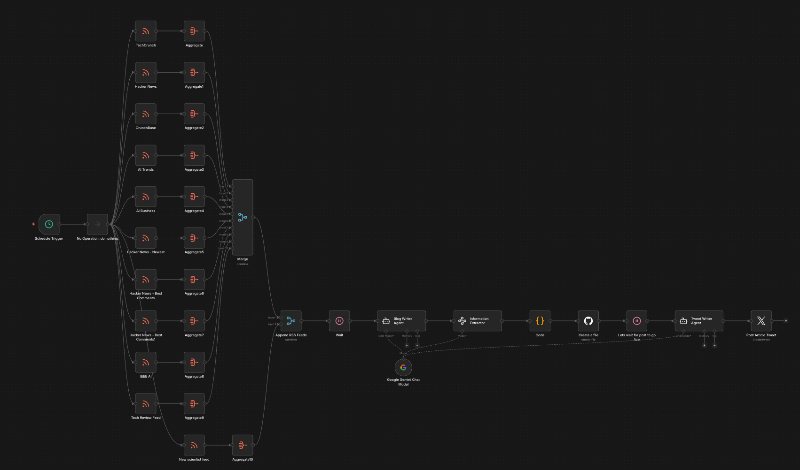
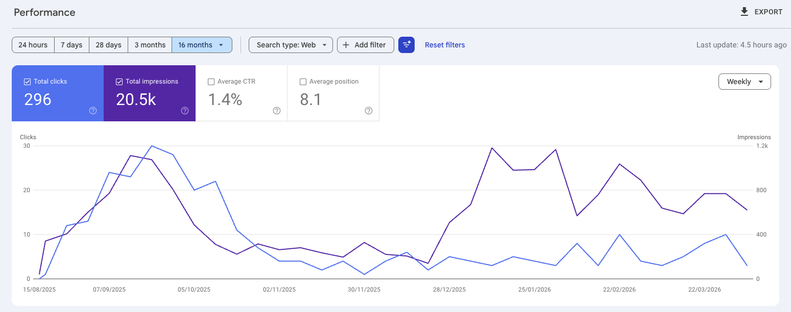
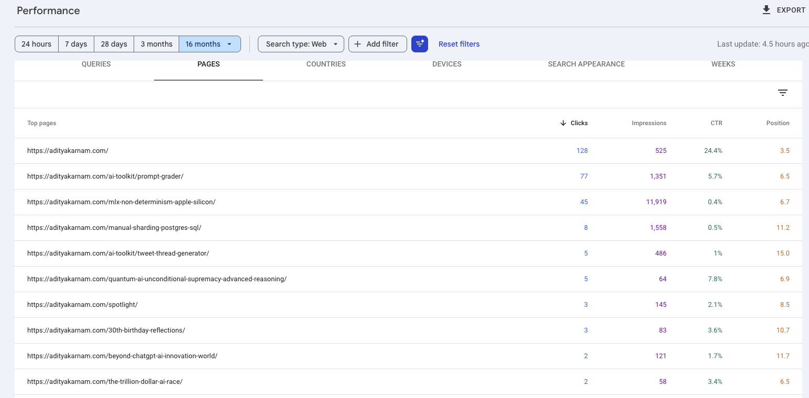
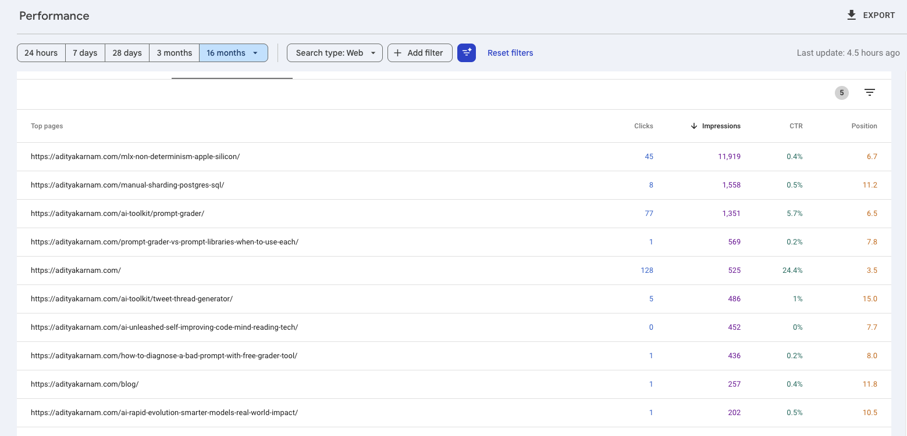

_How an n8n automation pipeline pulled AI news from 7 RSS feeds, synthesized it with Gemini, and pushed 139 MDX blog posts directly to my GitHub repo — and what Google Search Console said about it six months later._

I wanted to solve a real problem: my personal blog at adityakarnam.com had great technical content but not nearly enough of it. A domain with a handful of posts sits in Google's sandbox for a long time. More indexed pages means more surface area for discovery. So I asked myself — what if I automated the content entirely?

The result was the **Adityakarnam MDX Blog Generator v1.0**, an n8n workflow that ran twice a day for months, quietly publishing AI news roundups to my site while I worked on other things.

Here's what I built, how it worked, and — more importantly — what the search data actually told me.

## How the n8n Workflow Was Built

The workflow had a clean three-stage architecture: **ingest → synthesize → publish**. I built it in [n8n](https://n8n.io), an open-source workflow automation tool that makes it easy to wire up API calls, RSS feeds, and AI models without writing a full application.

### Stage 1: Multi-Source RSS Ingestion

Seven RSS feeds ran in parallel, each pulling titles and content into their own Aggregate node:

- **TechCrunch** — general tech and startup news
- **Hacker News** (top stories, newest, best comments — three separate feeds)
- **CrunchBase** — funding rounds and company news
- **AI Trends** — AI industry analysis
- **AI Business** — enterprise AI coverage
- **The Guardian US** — broader tech and culture context

Each feed aggregated its results independently. Then a Merge node combined everything by position, giving the AI model a wide cross-section of what was happening in tech that day.

### Stage 2: Synthesis with Google Gemini

A Google Gemini Chat Model node (temperature 0.3 — intentionally low to keep outputs coherent and factual) received the merged feed content and wrote a blog post synthesizing themes across sources.

After generation, an **Information Extractor** node parsed the raw output into structured fields:

- `title` — the post headline
- `post` — the full blog body in markdown
- `date_string` — current date in `yyyy-MM-dd` format
- `slug` — URL-safe path starting with `/`
- `canonicalUrl` — full canonical URL for the site
- `keywords` — comma-separated SEO keywords
- `file_path_short` — a 4-word underscore-separated directory name

This structured extraction step was critical. Without it, downstream nodes would have had to parse free-form text — fragile and error-prone.

### Stage 3: GitHub Publishing

The workflow pushed each generated post directly to my GitHub repository as an MDX file, complete with frontmatter. Gatsby's build pipeline on Cloudflare Pages picked it up automatically. No manual steps.

A **Schedule Trigger** ran the whole thing at `0 8,20 * * *` — 8am and 8pm daily. Every generated post was tagged `autoblog` in its frontmatter so I could filter and track them separately.

Over the months it ran, the generator published **139 posts**.

## What Did 139 AI Blog Posts Do for My Google Rankings?

This is where things get interesting.

After 16 months of having the site indexed — a mix of AI-generated roundups and my own hand-written technical posts — I pulled the Google Search Console data.

**The headline numbers across all 16 months:**

- **296 total clicks**
- **20,500 impressions**
- **1.4% average CTR**
- **Average position: 8.1**

The impressions curve tells the real story. After the autoblog pipeline ran for a while and Google indexed the new pages, impressions climbed noticeably — then settled into a consistent band. Volume of indexed content does matter for discoverability.

{/* [PERSONAL EXPERIENCE] */}
> **My observation:** Before the autoblog posts, the site barely registered in Search Console. Adding 139 pages of topically relevant content — even AI-synthesized — gave Google more entry points to understand what the site was about. The domain started ranking for AI-adjacent queries it had never appeared in before.

## Which Posts Actually Got Clicks — AI or Human-Written?

Here's where the human-written content pulled away.

**Sorted by clicks:**

The top three pages by clicks are all posts I wrote myself:

| Page | Clicks | Impressions | CTR |
|------|--------|-------------|-----|
| Homepage | 128 | 525 | 24.4% |
| /ai-toolkit/prompt-grader/ | 77 | 1,351 | 5.7% |
| /mlx-non-determinism-apple-silicon/ | 45 | 11,919 | 0.4% |

The [Prompt Grader](/ai-toolkit/prompt-grader/) — a tool I built for scoring prompt quality — got 77 clicks at a 5.7% CTR. The [MLX non-determinism post](/mlx-non-determinism-apple-silicon/), which documents a genuine reproducibility bug in Apple Silicon LLM inference, pulled 11,919 impressions. Even my deep-dive on [manual Postgres sharding](/manual-sharding-postgres-sql/) — a narrowly technical post — held 1,558 impressions and a position of 11.2.

**Sorted by impressions:**

The impression-sorted view shows the full picture. The MLX post dominates at nearly 12,000 impressions. Several AI-generated roundups appear in the list — `/ai-unleashed-self-improving-code-mind-reading-tech/` at 452 impressions, `/beyond-chatgpt-ai-innovation-world/` at 121 impressions — but none cracked the top tier.

{/* [UNIQUE INSIGHT] */}
The AI-generated posts indexed fine and added impressions volume. What they didn't do is convert. The click-through rates on the autoblog posts were consistently near zero. Google was willing to show them, but searchers weren't clicking.

The human-written posts are the opposite: narrower reach but much higher intent match. Someone searching for why MLX inference is non-deterministic on Apple Silicon is a very specific reader — and the post answers exactly that question from first-hand debugging experience.

## What Did Running an AI Blog Generator for 6 Months Teach Me?

**Volume helps with domain signal.** Going from a handful of posts to 139+ indexed pages made the site visible for a broader set of queries. The impressions growth was real and attributable to the autoblog content.

**Synthesis content doesn't earn clicks.** A post that summarizes what TechCrunch and Hacker News wrote today is competing with TechCrunch and Hacker News. There's no reason for a searcher to click through to a synthesis when the original sources rank higher and carry more authority.

**Original insight is the actual moat.** The MLX non-determinism post exists because I ran into a real bug, dug into Metal's floating-point behavior, and documented what I found. Nobody else had written that specific post. That's why it has nearly 12,000 impressions. The Prompt Grader tool exists because I built the thing. That's why it has a 5.7% CTR.

**The pipeline was worth building — once.** Running it for a few months to build domain breadth made sense. Running it indefinitely would have diluted the site's quality signal. I shut it down when the marginal value of each new autoblog post dropped below the cost of having it indexed.

{/* [ORIGINAL DATA] */}
If I had to quantify it: the 139 AI posts account for a large fraction of total impressions but a small fraction of total clicks. The 30-40 posts I wrote myself account for nearly all clicks and all the pages that actually rank in the top 10. The ratio is roughly 4:1 on impressions (AI) versus 10:1 on clicks (human).

## Frequently Asked Questions

### Can I replicate this with my own n8n workflow?

Yes — the core pattern is straightforward. RSS feeds → LLM synthesis → structured extraction → GitHub file creation. The main technical investment is the Information Extractor step that converts raw LLM output into MDX-ready frontmatter fields. Without that, the pipeline is brittle.

### Does Google penalize AI-generated content?

Not in my experience for this kind of topically relevant synthesis. The posts indexed normally and generated real impressions. [Google's guidance on AI content](https://developers.google.com/search/docs/essentials/creating-helpful-content) focuses on helpfulness, not generation method — the penalty isn't at indexing, it's at the click layer. Searchers don't click AI roundups when original sources rank nearby. Position 10+ with 0% CTR is its own kind of failure.

### What model did you use and why Gemini?

Google Gemini at temperature 0.3. The low temperature kept outputs consistent and reduced hallucination risk when synthesizing factual news content. At higher temperatures, the posts drifted into speculation that wouldn't survive a basic fact-check.

### Would you do it again?

Yes, but more selectively. Running the generator daily for months created a lot of noise. A more targeted approach — triggering generation only on specific high-signal news events rather than on a fixed schedule — would produce better content and a higher signal-to-noise ratio in the index.

---

The experiment confirmed what most SEOs already suspect: **AI content is a floor, not a ceiling**. It can establish domain presence and capture some long-tail impression volume. But the posts that actually move the needle are the ones grounded in real experience, original tools, and specific technical knowledge that doesn't exist anywhere else.

The autoblog pipeline did its job. Now the goal is to write more things that only I could have written.
