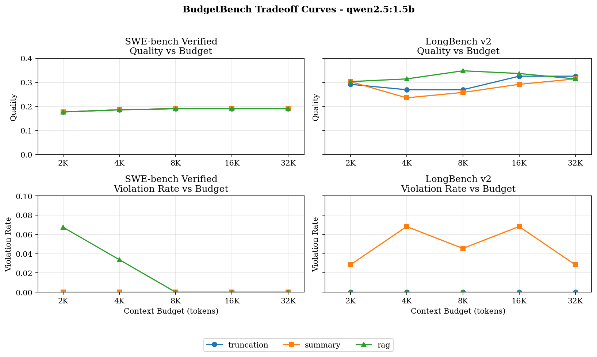

_An entry in [AI Research Explained](/ai-research/) — my own papers and other researchers' work, broken down in plain language._

## The paper

[**BudgetBench: A Budget-Tiered Protocol and Pilot Harness for Memory Strategy Evaluation in Local Large Language Model Agents**](https://arxiv.org/abs/2609.13149), co-authored with Arjun Jaggi, is now on arXiv as arXiv:2609.13149 (cs.LG, cs.CL). It runs 44 pages with 4 figures. The harness, raw logs, result CSVs, and the paper source are open at [github.com/aviskaar/budgetbench](https://github.com/aviskaar/budgetbench).

> **TL;DR:** Most memory-strategy comparisons for LLM agents don't fix how many input tokens each model call is allowed to use, so their numbers can't be compared. BudgetBench fixes the model, task, sampler, and decoding settings, then sweeps the per-call input budget over 2K, 4K, 8K, 16K, and 32K tokens and logs quality, budget use, latency, and how often a strategy blows the budget. On a 500-question LongMemEval study, retrieval at 2K (0.646) matched what truncation needed 8K to reach (0.650). On LongBench v2, whether a budgeted strategy can match full context is still unresolved, and the paper says so.

## The question it asks

Context windows keep growing, which makes memory management look optional: if the model accepts the whole trace, why retrieve or summarize anything?

On local hardware that argument falls apart quickly. A laptop can run an 8B or 14B model comfortably at short context and then crawl at long context. Even when 32K tokens fit in memory, you may not want to pay the prefill latency on every agent turn. So the number that matters in practice isn't the advertised window. It's the budget you're willing to spend per call.

That leads to the question the paper is built around: given a fixed local model, a fixed task, and a fixed per-call budget, which memory strategy should the agent use?

SWE-bench, LongBench, RULER, HELMET, and τ-bench all measure related things, but none of them standardize that budget as the variable you sweep. And to be clear about novelty: sweeping budgets isn't new. ContextBudget, BudgetMem, and Engram all put budgets at the center of a method. What BudgetBench adds is the measurement side: local serving, fixed per-call budgets, swappable strategies, versioned graders, and logs that make quality, latency, and compliance comparable across strategies.

## Active budget is not the context window

The paper separates three numbers that usually get blurred together:

- **The nominal context window** is what the model card advertises.
- **Total task cost** is every token spent across all calls in a task.
- **The active budget** is how many input tokens one call is allowed to see.

A model can support 32K while your app gives an interactive turn 4K. An agent can burn a lot of total tokens while each call stays small. BudgetBench isolates the third number because it's the one a memory strategy directly controls.

Formally, a strategy takes a message history and a budget and returns a message list that fits. Quality at a given (strategy, budget, task, model) cell is the mean grader score over the items. Everything else in the paper follows from holding that definition still.

## How the harness works

<svg viewBox="0 0 900 250" xmlns="http://www.w3.org/2000/svg" role="img" aria-labelledby="bbFlowTitle bbFlowDesc" fontFamily="'JetBrains Mono','Fira Code',Consolas,monospace" style={{width: "100%", height: "auto"}}>
  <title id="bbFlowTitle">BudgetBench evaluation path</title>
  <desc id="bbFlowDesc">A task item is formatted as chat messages. A memory strategy rewrites those messages for a given budget. The budget enforcer independently counts tokens. If the prompt fits, it goes to the model and then the grader. If it does not fit after retries, the run logs a violation row instead of dropping the item. Both paths write to the same per-cell JSONL log.</desc>
  <rect x="0" y="0" width="900" height="250" fill="#FAF9F7"/>
  <defs>
    <marker id="bbArrow" viewBox="0 0 10 10" refX="9" refY="5" markerWidth="7" markerHeight="7" orient="auto-start-reverse">
      <path d="M0,0 L10,5 L0,10 z" fill="#6B6B63"/>
    </marker>
  </defs>

  <rect x="20" y="40" width="150" height="70" rx="10" fill="#F2F0EC" stroke="#D8D4CC"/>
  <text x="32" y="66" fontSize="12.5" fill="#1A1A18" fontWeight="700">Task item</text>
  <text x="32" y="84" fontSize="10" fill="#6B6B63">formatted as</text>
  <text x="32" y="97" fontSize="10" fill="#6B6B63">chat messages</text>

  <rect x="200" y="40" width="170" height="70" rx="10" fill="#FFFFFF" stroke="#C2522D"/>
  <text x="212" y="66" fontSize="12.5" fill="#1A1A18" fontWeight="700">MemoryStrategy</text>
  <text x="212" y="84" fontSize="10" fill="#6B6B63">messages + budget in,</text>
  <text x="212" y="97" fontSize="10" fill="#6B6B63">messages out</text>

  <rect x="400" y="40" width="170" height="70" rx="10" fill="#FFFFFF" stroke="#D8D4CC" strokeWidth="2"/>
  <text x="412" y="66" fontSize="12.5" fill="#1A1A18" fontWeight="700">Budget enforcer</text>
  <text x="412" y="84" fontSize="10" fill="#6B6B63">counts tokens itself,</text>
  <text x="412" y="97" fontSize="10" fill="#6B6B63">retries, then rejects</text>

  <rect x="600" y="40" width="130" height="70" rx="10" fill="#F2F0EC" stroke="#D8D4CC"/>
  <text x="612" y="66" fontSize="12.5" fill="#1A1A18" fontWeight="700">Model call</text>
  <text x="612" y="84" fontSize="10" fill="#6B6B63">temperature 0,</text>
  <text x="612" y="97" fontSize="10" fill="#6B6B63">fixed seed</text>

  <rect x="760" y="40" width="120" height="70" rx="10" fill="#F2F0EC" stroke="#D8D4CC"/>
  <text x="772" y="66" fontSize="12.5" fill="#1A1A18" fontWeight="700">Grader</text>
  <text x="772" y="84" fontSize="10" fill="#6B6B63">deterministic</text>
  <text x="772" y="97" fontSize="10" fill="#6B6B63">or versioned</text>

  <path d="M170,75 H200" fill="none" stroke="#6B6B63" strokeWidth="1.5" markerEnd="url(#bbArrow)"/>
  <path d="M370,75 H400" fill="none" stroke="#6B6B63" strokeWidth="1.5" markerEnd="url(#bbArrow)"/>
  <path d="M570,75 H600" fill="none" stroke="#6B6B63" strokeWidth="1.5" markerEnd="url(#bbArrow)"/>
  <text x="585" y="66" fontSize="9.5" fill="#6B6B63" textAnchor="middle">fits</text>
  <path d="M730,75 H760" fill="none" stroke="#6B6B63" strokeWidth="1.5" markerEnd="url(#bbArrow)"/>

  <path d="M485,110 V170" fill="none" stroke="#C2522D" strokeWidth="1.5" markerEnd="url(#bbArrow)"/>
  <text x="495" y="145" fontSize="9.5" fill="#C2522D">over budget</text>
  <path d="M820,110 V140 H640 V170" fill="none" stroke="#6B6B63" strokeWidth="1.5" markerEnd="url(#bbArrow)"/>

  <rect x="330" y="170" width="440" height="56" rx="10" fill="#F2F0EC" stroke="#D8D4CC"/>
  <text x="550" y="194" fontSize="12" fill="#1A1A18" textAnchor="middle" fontWeight="700">Per-cell JSONL log</text>
  <text x="550" y="212" fontSize="10" fill="#6B6B63" textAnchor="middle">quality · violation rate · used and peak tokens · duration · prompt hash</text>
</svg>

Two design choices carry most of the weight.

**The strategy contract is tiny.** A `MemoryStrategy` gets a list of chat messages and an integer budget, and returns a list of chat messages. It knows nothing about the task. That's what lets you drop in a new memory policy without touching task code. The reference strategies are truncation, summary-buffer compression, episodic RAG (sentence-transformer embeddings in an in-memory Chroma collection), lean retrieval, a checkpoint-context hybrid, and a `full_context` pass-through.

**The runner doesn't trust the strategy.** After the strategy returns, the enforcer counts tokens on its own. If the prompt is over budget it retries, and if it's still over, it logs a row with violation rate 1.0 for that item. The item doesn't disappear from the table. I think this is the most useful idea in the paper: a strategy that can't produce a compliant prompt has failed differently from one that produced a compliant prompt and got the answer wrong, and a benchmark that silently drops the first kind is overstating the strategy.

This is also why `full_context` is in the matrix at every tier. At 2K it mostly fails, and that failure is recorded as a number instead of a missing cell.

## What we ran

| Study | Model | Items | Budgets | Grader |
| --- | --- | --- | --- | --- |
| Local pilot | `qwen2.5:1.5b` via Ollama | 89 each on SWE-bench Verified and LongBench v2 | 2K–32K | Patch-similarity proxy / exact match |
| Full-context-feasible slice | `qwen2.5:1.5b` via Ollama | 50 LongBench v2 items that fit in 32K | 2K, 8K, 32K | Exact match |
| Hosted replication | Qwen3 30B-A3B via OpenRouter | Same 50-item rule, 2 shuffled repeats | 8K, 32K | Exact match, exact tokenizer |
| Synthetic memory pilot | `qwen2.5:1.5b` via Ollama | 30 items, 5 memory categories | 512, 1,024, 2,048 | Exact match |
| LongMemEval oracle study | `gpt-4o-mini` via OpenRouter | All 500 oracle-file questions | 2K, 4K, 8K | Official evaluator with GPT-4o |

All runs use temperature 0 and a fixed seed. The SWE-bench rows use a patch-similarity proxy (40% file-level recall plus 60% changed-line overlap), which is not the official resolved rate. The paper treats those rows as a plumbing check for enforcement and logging and nothing more.

## Result 1: bigger budgets don't reliably help



On the 89-item LongBench v2 pilot, none of the three curves rises steadily with budget:

| Strategy | 2K | 4K | 8K | 16K | 32K |
| --- | --- | --- | --- | --- | --- |
| Truncation | 0.29 | 0.27 | 0.27 | 0.33 | 0.33 |
| Summary | 0.30 | 0.24 | 0.26 | 0.29 | 0.31 |
| RAG | 0.30 | 0.31 | 0.35 | 0.34 | 0.31 |

RAG peaks at 8K and drops back by 32K. Summary gets worse from 2K to 4K. The 95% bootstrap intervals overlap heavily across these cells, so this is not a ranking. What it does show is that a single-budget evaluation would have picked one column of this table and reported a conclusion that the neighboring column contradicts. More context also means more distractors and different evidence positions, and a 1.5B model feels that.

The summary strategy was also the only one to violate the budget on LongBench (3–7% of items per tier), and it pays for an extra generation call before every answer. On the SWE side the curves collapse at 8K and above because those prompts are short enough that every strategy ends up sending the same thing.

## Result 2: can a budgeted strategy match full context? Unresolved.

This is the comparison people care about most, and the two studies disagree.

**Local 1.5B model, 50 items.** Full context at 32K scored 0.32. RAG at 8K scored 0.34, truncation at 2K scored 0.34. Every paired delta against full context has a bootstrap interval that includes zero: RAG at 8K is +0.02 with [-0.08, +0.12]. That's a near-null result. It doesn't establish equivalence either, because the interval is far too wide.

**Hosted Qwen3 30B-A3B, same selection rule, exact tokenizer, two shuffled repeats.**

| Strategy | Budget | Accuracy | Paired delta vs. full context at 32K |
| --- | --- | --- | --- |
| Full context | 32K | 0.53 | — |
| Truncation | 32K | 0.53 | 0.00 [0.00, 0.00] |
| RAG | 32K | 0.52 | -0.01 [-0.04, +0.02] |
| Lean retrieval | 32K | 0.51 | -0.02 [-0.05, 0.00] |
| RAG | 8K | 0.46 | -0.07 [-0.17, +0.02] |
| Lean retrieval | 8K | 0.44 | -0.09 [-0.20, +0.02] |
| Truncation | 8K | 0.33 | -0.20 [-0.34, -0.07] |
| Full context | 8K | 0.00 | rejected before inference |

With the stronger model, truncation at 8K is clearly worse than full context: the interval excludes zero. RAG at 8K closes most of that gap but the point estimate still favors full context, and its interval can't support a "no loss" claim. The whole hosted matrix cost $0.91 to run.

So the honest summary is: near-null on the small local model, leaning toward full context on the stronger hosted model, and no paired interval anywhere that establishes equivalence. The abstract says this directly. The one thing both studies agree on is the compliance side: full context is simply not an option at 2K or 8K for these items, and truncation and retrieval are.

## Result 3: on memory tasks, retrieval buys you budget

The clearest signal is in the LongMemEval oracle study: 500 questions, four strategies, three budgets, 6,000 rows. The enforcer admitted 5,122 prompts and rejected 878 full-context prompts before inference. Every admitted prediction was scored by the upstream `evaluate_qa.py` evaluator with GPT-4o.

<svg viewBox="0 0 900 310" xmlns="http://www.w3.org/2000/svg" role="img" aria-labelledby="bbLmeTitle bbLmeDesc" fontFamily="'JetBrains Mono','Fira Code',Consolas,monospace" style={{width: "100%", height: "auto"}}>
  <title id="bbLmeTitle">LongMemEval oracle accuracy by strategy and budget</title>
  <desc id="bbLmeDesc">Grouped bar chart of official GPT-4o evaluator accuracy on 500 LongMemEval oracle questions. At 2K tokens: truncation 0.380, RAG 0.646, lean retrieval 0.664. At 4K: truncation 0.570, RAG 0.686, lean retrieval 0.686. At 8K: truncation 0.650, RAG 0.686, lean retrieval 0.682.</desc>
  <rect x="0" y="0" width="900" height="310" fill="#FAF9F7"/>
  <rect x="20" y="16" width="14" height="14" fill="#D8D4CC"/>
  <text x="40" y="28" fontSize="11" fill="#6B6B63">Truncation</text>
  <rect x="140" y="16" width="14" height="14" fill="#C2522D"/>
  <text x="160" y="28" fontSize="11" fill="#6B6B63">RAG</text>
  <rect x="210" y="16" width="14" height="14" fill="#6B6B63"/>
  <text x="230" y="28" fontSize="11" fill="#6B6B63">Lean retrieval</text>
  <line x1="20" y1="260" x2="880" y2="260" stroke="#D8D4CC" strokeWidth="1"/>

  <rect x="80" y="154" width="60" height="106" fill="#D8D4CC"/>
  <text x="110" y="147" fontSize="11" fill="#1A1A18" textAnchor="middle">0.380</text>
  <rect x="150" y="79" width="60" height="181" fill="#C2522D"/>
  <text x="180" y="72" fontSize="11" fill="#1A1A18" textAnchor="middle">0.646</text>
  <rect x="220" y="74" width="60" height="186" fill="#6B6B63"/>
  <text x="250" y="67" fontSize="11" fill="#1A1A18" textAnchor="middle">0.664</text>
  <text x="180" y="282" fontSize="11.5" fill="#1A1A18" textAnchor="middle" fontWeight="700">2K budget</text>

  <rect x="350" y="100" width="60" height="160" fill="#D8D4CC"/>
  <text x="380" y="93" fontSize="11" fill="#1A1A18" textAnchor="middle">0.570</text>
  <rect x="420" y="68" width="60" height="192" fill="#C2522D"/>
  <text x="450" y="61" fontSize="11" fill="#1A1A18" textAnchor="middle">0.686</text>
  <rect x="490" y="68" width="60" height="192" fill="#6B6B63"/>
  <text x="520" y="61" fontSize="11" fill="#1A1A18" textAnchor="middle">0.686</text>
  <text x="450" y="282" fontSize="11.5" fill="#1A1A18" textAnchor="middle" fontWeight="700">4K budget</text>

  <rect x="620" y="78" width="60" height="182" fill="#D8D4CC"/>
  <text x="650" y="71" fontSize="11" fill="#1A1A18" textAnchor="middle">0.650</text>
  <rect x="690" y="68" width="60" height="192" fill="#C2522D"/>
  <text x="720" y="61" fontSize="11" fill="#1A1A18" textAnchor="middle">0.686</text>
  <rect x="760" y="69" width="60" height="191" fill="#6B6B63"/>
  <text x="790" y="62" fontSize="11" fill="#1A1A18" textAnchor="middle">0.682</text>
  <text x="720" y="282" fontSize="11.5" fill="#1A1A18" textAnchor="middle" fontWeight="700">8K budget</text>

  <text x="450" y="302" fontSize="10" fill="#6B6B63" textAnchor="middle">Official LongMemEval evaluator (GPT-4o), N = 500 per bar</text>
</svg>

Truncation is strongly budget-sensitive: 0.380 at 2K, 0.570 at 4K, 0.650 at 8K. Both retrieval variants are already at 0.646 and 0.664 at 2K, meet at 0.686 by 4K, and stay flat after that. Put differently, retrieval at a 2K budget gets roughly what truncation needs 8K to reach. The two retrieval variants are not separable: their intervals overlap at 4K and 8K.

The full-context rows need a warning. Full context scored 0.979 at 2K, which looks spectacular until you see that only 48 of 500 prompts fit. The enforcer rejected the other 452. Those rows are conditioned on the short, easy histories that survive the gate, so the paper labels them feasibility diagnostics and says not to compare them with the 500-question cells. Any harness that drops over-budget items without counting them would have reported that 0.979 as a result.

The full study, including GPT-4o judging, cost $5.01.

The 30-item synthetic memory pilot shows the same shape with deterministic scoring. At a 512-token budget, truncation scored 0.43 and lean retrieval 0.80, matching full context at 2,048. The category split explains why: tight truncation drops early single-session facts and temporal evidence, and retrieval recovers them. Preference questions stayed poor for every strategy including full context, which the paper flags as a prompt or model weakness, not a memory result. The scope caveat matters here too: this is the LongMemEval oracle file with an API-hosted model, not a LongMemEval_S full-history leaderboard number.

## The tokenizer bug in our own numbers

The early local pilot counted tokens with `tiktoken` instead of the served model's tokenizer. A post-hoc audit with the actual `Qwen/Qwen2.5-1.5B-Instruct` tokenizer found Qwen counts averaged 5.5% higher (median 4.1%, range -6.4% to +31.4%). Recounting the reconstructed truncation prompts, 14, 35, 53, 65, and 50 of 89 would have been over budget at 2K, 4K, 8K, 16K, and 32K.

That's a lot of prompts, and those rows all reported a violation rate of 0.00. So the paper downgrades its own 89-item LongBench table: the violation rows are labeled tokenizer-approximation diagnostics, not compliance results. The runner now takes an explicit `--tokenizer`, and logs the tokenizer ID, a prompt hash, the post-strategy prompt, and the counted tokens for every call. The hosted 30B replication and a 10-item hardened rerun use exact tokenization end to end.

I'd rather publish that than quietly rerun and hide it. A budget benchmark whose token counts are 5% off is measuring a different budget than the one on the label, and anyone using `tiktoken` as a stand-in for a non-OpenAI model is probably making the same mistake.

## What this paper doesn't claim

- **No strategy ranking.** The paper says in so many words that the pilot does not justify a rule like "use RAG instead of truncation." The samples are 30 to 89 items for most studies, mostly single-run.
- **No latency claims.** Every duration is an operational diagnostic. In the hosted run, truncation at 32K and full context at 32K send identical prompts and still differ by about 16 seconds, which is provider variance.
- **One claim-bearing local model.** Only `qwen2.5:1.5b` is treated as publicly reproducible. The larger local MLX aliases lack registry and quantization provenance, so their rows are infrastructure checks. We also list the small-model runs that scored zero instead of leaving them out.
- **SWE-bench rows are a scaffold.** Proxy metric, short prompts, collapsed curves.
- **Generic strategies.** The summarizer is the same 1.5B model, and RAG uses off-the-shelf embeddings with message-level chunks. A small ablation hints at how much this matters: forcing 256-token chunks moved 8K RAG accuracy from 0.50 to 0.60 on a 10-item slice, while swapping in a heavier MPNet embedder changed nothing except runtime.

## If you're choosing a memory strategy for a real agent

The practitioner section of the paper boils down to this sequence:

1. **Pin the envelope first.** Model, tokenizer, hardware or provider, latency target, and one or two budget tiers you actually plan to ship, such as 4K for an interactive local assistant.
2. **Gate on compliance before quality.** A strategy that exceeds the tier has failed the operating contract. It isn't a slower version of a compliant one.
3. **Use small runs only for plumbing.** One to three items tells you the endpoint, adapter, and tokenizer work. For a comparison you intend to act on, use at least 100 items with paired item-level estimates.
4. **Measure the full cost.** Quality, violation rate, latency, mean and peak tokens, auxiliary model calls, and any persistent index.
5. **Read what survived.** Look at the retrieved chunks, check whether the summary kept the entities and ordering that decide the answer, and check what truncation threw away.

And if a smaller budget beats a larger one, look at the item-level flips before assuming it's noise. It may mean the strategy is filtering distractors.

## Running it

```bash
git clone https://github.com/aviskaar/budgetbench
cd budgetbench
pip install -e .

# full five-tier sweep against a local Ollama model, with the served model's tokenizer
python scripts/run_pilot.py --full-study \
  --model qwen2.5:1.5b \
  --tokenizer Qwen/Qwen2.5-1.5B-Instruct \
  --repeat-cells 3 --shuffle-cells
```

`--tokenizer` is the flag that came out of the audit above. Without it you get the fallback approximation. `--repeat-cells` and `--shuffle-cells` exist so latency numbers aren't an artifact of warmup order. Raw logs land as one JSONL file per task, strategy, and budget, and `scripts/analyze_results.py` and `scripts/plot_tradeoffs.py` turn them into the tables and figures in the paper. Adding a strategy means subclassing `MemoryStrategy`: a `__call__(messages, active_budget)` that returns the messages to send, plus a `reset()` the runner calls between items.

## What's next

The scaling plan in the paper is mostly about evidence, not features: fully specified stronger local models, at least 100 items per claim-bearing comparison with repeated cells, LongMemEval_S full-history runs to follow up the oracle study, official SWE-bench resolution or a deterministic trace-debugging task in place of the proxy, richer strategy families (Mem0, Letta, and LLMLingua-2 adapters are already in the repo as optional dependencies), and multimodal tasks under the same budget discipline.

## Why it matters

Budget is part of the agent harness, the same way the tool set and the verification loop are. I made that argument in [What Is an AI Agent Harness?](/ai-research/what-is-an-ai-agent-harness/), and BudgetBench is the measurement side of it. "Which memory strategy is best" has no answer until you say how many tokens each call gets, and this is an attempt to make that number explicit, enforced, and logged, including the rows where a strategy failed and the rows where our own tooling was wrong.

If you run it on your own model and hardware, I'd like to see the curves. Issues and PRs are open on [the repo](https://github.com/aviskaar/budgetbench).

## Related reading

- [AI Research Explained](/ai-research/) — the section this explainer lives in
- [What Is an AI Agent Harness?](/ai-research/what-is-an-ai-agent-harness/) — where budget fits alongside tools, memory, and verification
- [MEDFIT-LLM Explained](/medfit-llm-explained/) — the previous paper walkthrough in this series
- [Field Notes](/field-notes/) — infrastructure-focused notes on memory, routing, and local inference
