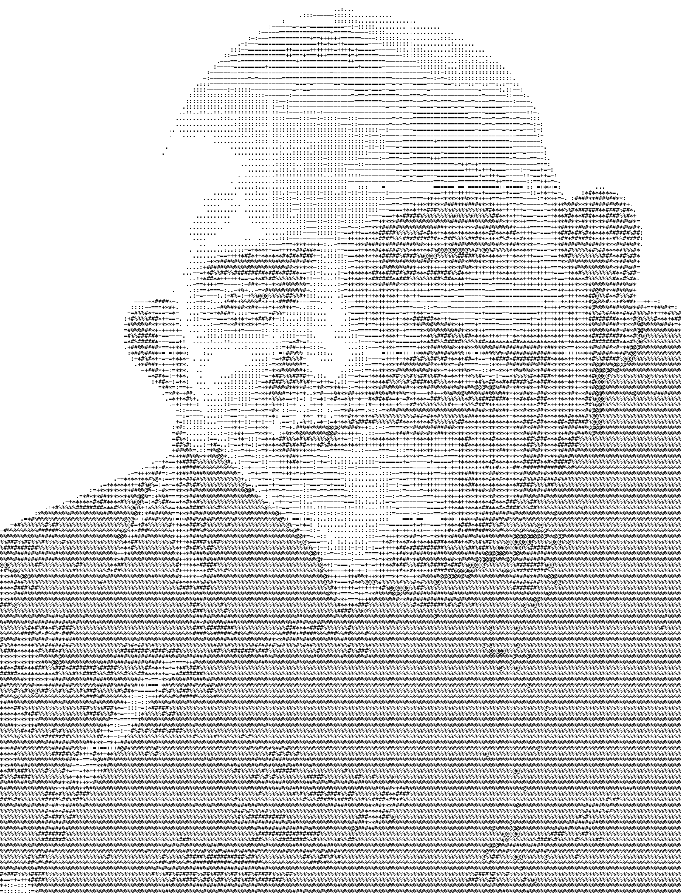

<MindockCTA />


# Turning 30: A Software Engineer's Journey

Today marks the beginning of a new decade in my life. Thirty years of existence, and six years of professional experience as a software engineer have shaped me in ways I never anticipated when I first wrote "Hello World" on a dusty computer screen in my childhood.

## The Path So Far

Looking back at my journey from a curious tech blogger at GglassGeeks to a Software Engineer III at Zefr, I realize how each experience has been a building block. From developing Android applications at Grocehurry to architecting remittance solutions that generated millions in transaction volume, each challenge has added a new dimension to my technical palette.

> "The only way to do great work is to love what you do." - This quote, attributed to Steve Jobs, has been my north star through countless lines of code, debugging sessions that extended into dawn, and the thrill of seeing users interact with something I created.

## Lessons in Code and Life

The past decade taught me that software engineering is as much about people as it is about technology. Leading teams, mentoring interns, and collaborating with clients has emphasized that communication skills rival technical prowess in importance. Building an NFT platform on Cardano or integrating Western Union API isn't just about understanding Plutus Smart Contracts or GraphQL—it's about translating business needs into elegant solutions.

When life hits hard, and nothing makes sense, I've learned to turn inwards. Only by addressing trauma, identifying it, and embracing it, can we begin to heal. Through difficult times, I've come to understand what it costs to genuinely smile, and that laughing silly was never meant to be such a burden.

## Finding Balance Beyond Code

My two cats stay with me, and I spend a lot of time with my first cat Zeus. He's a mischievous tabby cat who, surprisingly, seems to understand whatever I talk about and responds to me—unlike some previous relationships with people who never understood me even when we spoke the same language. This companionship has taught me that connection comes in many forms, and sometimes the most profound understanding comes from the simplest relationships.

On challenging days, I've learned to fuel myself with circumstances, channeling emotions toward getting better at my work and focusing on what I truly love to do. This emotional redirection has become a powerful tool in both personal growth and professional development.

## Future Compilations

As I compile the code for my thirties, my ambitions are clear: advancing to a Senior Software Engineer role and eventually becoming a CTO. My ongoing research in fine-tuning Large Language Models and developing AGI planning agents keeps me at the edge of innovation. But beyond career milestones, I want to continue contributing to open-source, sharing knowledge through my blog, and connecting the dots between technology and human experience.

Getting back to my health, taking care of my wealth, working in stealth mode, and silently and spiritually growing—these are the goals for the next few years. This year marks the transformation, the renaissance, the new beginning.

## Spiritual Anchors

Jai Hanuman! Jai Neem Karoli Baba. As I continue on this journey, your grace has been present at all times. Neem Karoli Baba (Maharaj-ji), born Lakshmi Narayan Sharma around 1900 in Akbarpur, India, was a revered Hindu saint known for his teachings on love, compassion, service, and devotion.[^1][^2][^5] A devotee of Hanuman, he inspired many spiritual seekers globally—including prominent Western figures such as Ram Dass and Steve Jobs—through his simple yet profound philosophy emphasizing unconditional love and selfless service.

Maharaj-ji established several temples across India—including Kainchi Dham—and became renowned for his miracles and spiritual wisdom.[^2] His teachings remind us that spirituality lies not in material wealth but in humility and seeing divinity in all beings.[^2][^4] Despite his passing in 1973, his legacy continues through his devotees worldwide who find solace in his timeless guidance.[^1][^3]

I'll leave this song lingering here to remind me that he is always present if I ever forget:

<iframe
  width="560"
  height="315"
  src="https://www.youtube.com/embed/asgE08uwOR4"
  title="YouTube video player"
  frameborder="0"
  allow="accelerometer; autoplay; clipboard-write; encrypted-media; gyroscope; picture-in-picture; web-share"
  allowfullscreen
></iframe>

## Commit Message for Year 30

```
git commit -m "feat(life): initialize decade-30 with enhanced resilience, deeper technical expertise, expanded vision, and spiritual groundedness"
```

Here's to debugging life's challenges with the same patience I apply to code and to building systems—both digital and personal—that scale with grace under pressure. The next commit begins now...



[^1]: https://timesofindia.indiatimes.com/life-style/soul-search/neem-karoli-baba-incarnation-of-lord-hanuman/photostory/105968228.cms
[^2]: https://kainchidhamtours.com/blog/the-life-and-teachings-of-neem-karoli-baba
[^3]: http://www.neebkaroribaba.com
[^4]: https://www.mokshamcampsite.com/post/experience-the-divine-at-kainchi-dham-a-spiritual-odyssey-with-neem-karoli-baba-s-teachings
[^5]: https://yogajala.com/neem-karoli-baba/
