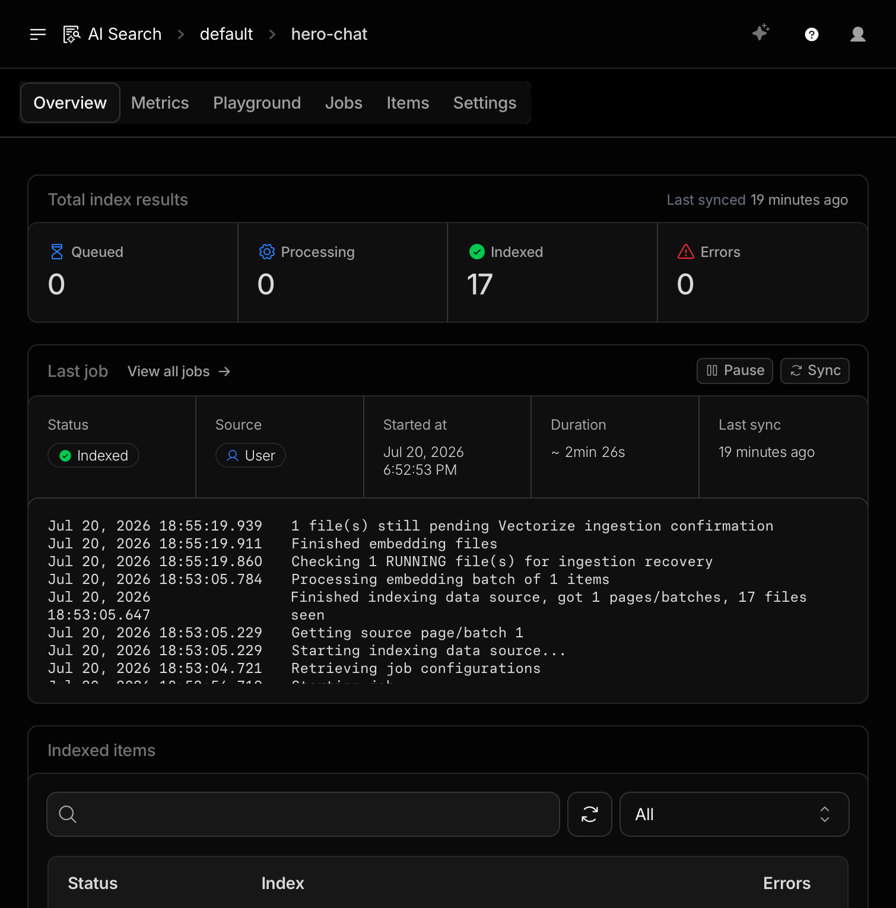
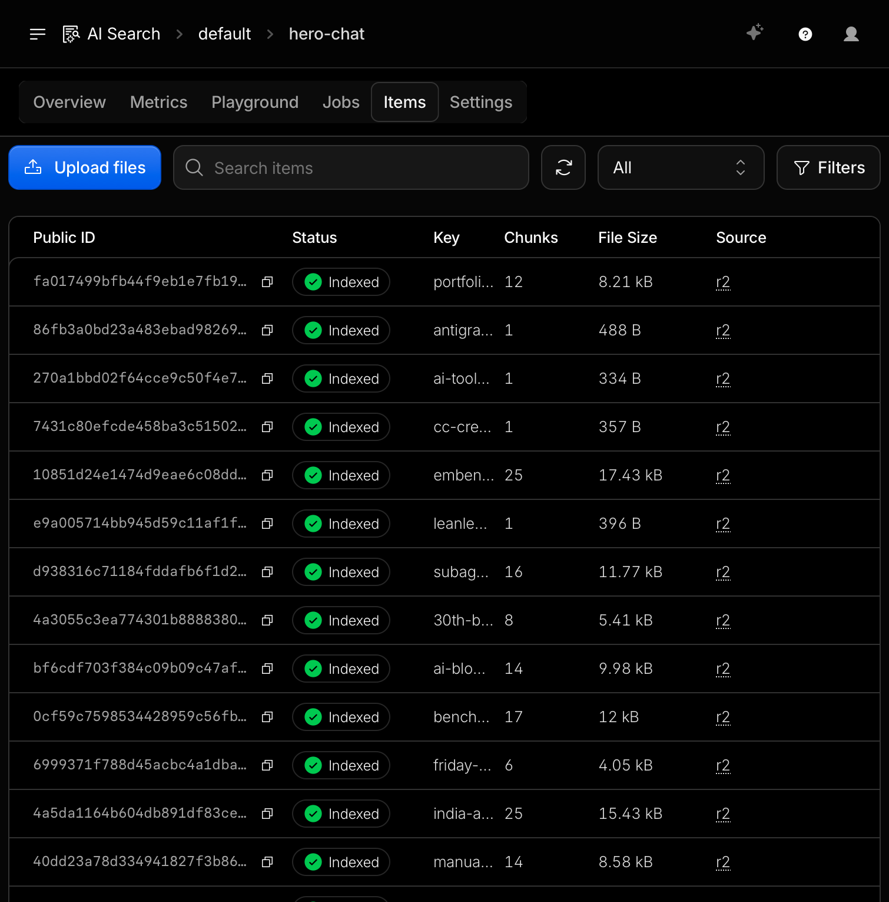
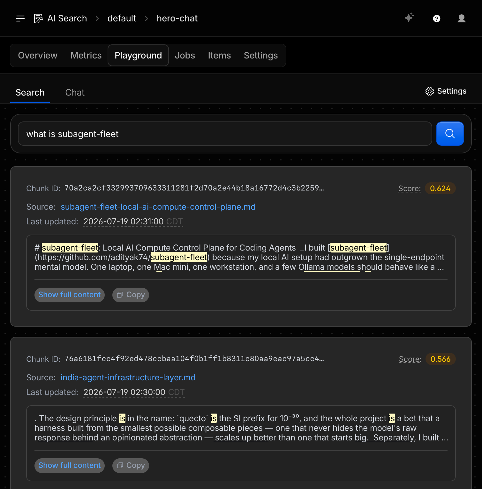

_This site used to have a standalone `/ask` page — a Q&A box bolted onto the nav, backed by OpenRouter and a hand-rolled retrieval layer. It worked, but it was a destination nobody visited on purpose. So I tore it out and put the same idea where people actually are: the homepage hero, as a multi-turn chat that adapts its answers to who's asking._

**TL;DR:** [adityakarnam.com](https://adityakarnam.com) now embeds a persona-adaptive RAG chat directly in the hero. It's grounded on a corpus built from this site's own posts and project pages, served through Cloudflare AI Search (formerly AutoRAG), with rate limiting, caching, and a hard no-hallucination fallback. Two PRs shipped it end to end: [#67](https://github.com/adityak74/adityakarnam.com/pull/67) (content sync pipeline) and [#71](https://github.com/adityak74/adityakarnam.com/pull/71) (the chat UI and query path).

## Why Replace `/ask` With Something in the Hero

A dedicated Q&A page has a discoverability problem: it's one more link in the nav that competes with "just read the posts." The fix wasn't a better `/ask` page, it was deleting the destination and moving the interaction to where attention already is. `HeroChat` now sits directly under the homepage headline, with five clickable persona chips — AI Researcher, Frontier Lab Recruiter, Founder, Engineer, Open Source Contributor — that change how the same underlying context gets framed in the answer.

## The Architecture

Two lanes, decoupled from each other: a build-time pipeline that keeps a retrieval corpus in sync with this site's content, and a request-time path that answers a question using whatever that corpus currently holds.

<svg viewBox="0 0 900 660" xmlns="http://www.w3.org/2000/svg" role="img" aria-labelledby="ragDiagramTitle ragDiagramDesc" fontFamily="'JetBrains Mono','Fira Code',Consolas,monospace" style={{width: "100%", height: "auto"}}>
  <title id="ragDiagramTitle">Hero RAG chat architecture</title>
  <desc id="ragDiagramDesc">Two-lane diagram. Build-time lane: blog posts and curated project pages flow through discover-content.mjs and render-corpus-doc.mjs into an R2 bucket, which Cloudflare AI Search indexes, triggered by a GitHub Actions workflow on push to main. Request-time lane: the HeroChat browser UI posts to a Cloudflare Pages Function that rate-limits and caches, injects a persona system prompt, queries the same AI Search instance for retrieval and generation, maps returned chunks to source links above a relevance threshold or falls back to static persona text on error, and returns the grounded answer with citations to the UI.</desc>
  <rect x="0" y="0" width="900" height="660" fill="#FAF9F7"/>
  <text x="24" y="34" fontSize="12" letterSpacing="0.08em" fill="#C2522D" fontWeight="700">BUILD-TIME · CONTENT SYNC</text>
  <text x="24" y="380" fontSize="12" letterSpacing="0.08em" fill="#C2522D" fontWeight="700">REQUEST-TIME · RETRIEVAL + GENERATION</text>
  <line x1="24" y1="46" x2="876" y2="46" stroke="#D8D4CC" strokeWidth="1"/>
  <line x1="24" y1="392" x2="876" y2="392" stroke="#D8D4CC" strokeWidth="1"/>
  <defs>
    <marker id="arrow" viewBox="0 0 10 10" refX="9" refY="5" markerWidth="7" markerHeight="7" orient="auto-start-reverse">
      <path d="M0,0 L10,5 L0,10 z" fill="#6B6B63"/>
    </marker>
    <marker id="arrowAccent" viewBox="0 0 10 10" refX="9" refY="5" markerWidth="7" markerHeight="7" orient="auto-start-reverse">
      <path d="M0,0 L10,5 L0,10 z" fill="#C2522D"/>
    </marker>
  </defs>
  <rect x="24" y="66" width="180" height="56" rx="10" fill="#F2F0EC" stroke="#D8D4CC"/>
  <text x="34" y="88" fontSize="10" letterSpacing="0.06em" fill="#6B6B63">SOURCE</text>
  <text x="34" y="106" fontSize="13" fill="#1A1A18">content/posts/**</text>
  <rect x="24" y="132" width="180" height="56" rx="10" fill="#F2F0EC" stroke="#D8D4CC"/>
  <text x="34" y="154" fontSize="10" letterSpacing="0.06em" fill="#6B6B63">SOURCE</text>
  <text x="34" y="172" fontSize="13" fill="#1A1A18">rag-project-pages.json</text>
  <path d="M204,94 H236 V127 H268" fill="none" stroke="#6B6B63" strokeWidth="1.5" markerEnd="url(#arrow)"/>
  <path d="M204,160 H268" fill="none" stroke="#6B6B63" strokeWidth="1.5" markerEnd="url(#arrow)"/>
  <rect x="268" y="98" width="200" height="90" rx="10" fill="#FFFFFF" stroke="#D8D4CC"/>
  <text x="278" y="120" fontSize="10" letterSpacing="0.06em" fill="#6B6B63">SCRIPT</text>
  <text x="278" y="140" fontSize="13" fill="#1A1A18" fontWeight="700">discover-content.mjs</text>
  <text x="278" y="158" fontSize="11" fill="#6B6B63">dedupe by slug,</text>
  <text x="278" y="173" fontSize="11" fill="#6B6B63">skip autoblog-tagged</text>
  <path d="M468,143 H500" fill="none" stroke="#6B6B63" strokeWidth="1.5" markerEnd="url(#arrow)"/>
  <rect x="500" y="98" width="200" height="90" rx="10" fill="#FFFFFF" stroke="#D8D4CC"/>
  <text x="510" y="120" fontSize="10" letterSpacing="0.06em" fill="#6B6B63">SCRIPT</text>
  <text x="510" y="140" fontSize="13" fill="#1A1A18" fontWeight="700">render-corpus-doc.mjs</text>
  <text x="510" y="158" fontSize="11" fill="#6B6B63">one markdown doc</text>
  <text x="510" y="173" fontSize="11" fill="#6B6B63">per source</text>
  <path d="M700,143 H732" fill="none" stroke="#6B6B63" strokeWidth="1.5" markerEnd="url(#arrow)"/>
  <rect x="732" y="98" width="144" height="90" rx="10" fill="#F2F0EC" stroke="#D8D4CC"/>
  <text x="742" y="120" fontSize="10" letterSpacing="0.06em" fill="#6B6B63">R2</text>
  <text x="742" y="140" fontSize="13" fill="#1A1A18" fontWeight="700">adityakarnam-</text>
  <text x="742" y="155" fontSize="13" fill="#1A1A18" fontWeight="700">rag-corpus</text>
  <rect x="268" y="222" width="200" height="60" rx="10" fill="#FFFFFF" stroke="#C2522D" strokeDasharray="3 3"/>
  <text x="278" y="243" fontSize="10" letterSpacing="0.06em" fill="#C2522D">TRIGGER</text>
  <text x="278" y="262" fontSize="12" fill="#1A1A18">GitHub Actions: push to</text>
  <text x="278" y="276" fontSize="12" fill="#1A1A18">main, path content/posts/**</text>
  <path d="M368,222 V198" fill="none" stroke="#C2522D" strokeWidth="1.5" markerEnd="url(#arrowAccent)"/>
  <path d="M804,188 V226 H548 V282" fill="none" stroke="#6B6B63" strokeWidth="1.5" markerEnd="url(#arrow)"/>
  <rect x="380" y="282" width="336" height="86" rx="10" fill="#FFFFFF" stroke="#D8D4CC" strokeWidth="2"/>
  <text x="396" y="306" fontSize="10" letterSpacing="0.06em" fill="#6B6B63">CLOUDFLARE AI SEARCH · instance "hero-chat"</text>
  <text x="396" y="328" fontSize="12" fill="#1A1A18">reindexes R2 · embeds with qwen3-embedding-0.6b</text>
  <text x="396" y="346" fontSize="12" fill="#1A1A18">chunks, retrieves, and generates in one call</text>
  <path d="M548,368 V414" fill="none" stroke="#C2522D" strokeWidth="1.5" strokeDasharray="2 3" markerEnd="url(#arrowAccent)"/>
  <text x="558" y="386" fontSize="10" fill="#C2522D">shared index</text>
  <rect x="24" y="412" width="200" height="90" rx="10" fill="#F2F0EC" stroke="#D8D4CC"/>
  <text x="34" y="434" fontSize="10" letterSpacing="0.06em" fill="#6B6B63">BROWSER</text>
  <text x="34" y="454" fontSize="13" fill="#1A1A18" fontWeight="700">HeroChat.tsx</text>
  <text x="34" y="472" fontSize="11" fill="#6B6B63">homepage hero,</text>
  <text x="34" y="487" fontSize="11" fill="#6B6B63">5 persona lenses</text>
  <path d="M224,457 H256" fill="none" stroke="#6B6B63" strokeWidth="1.5" markerEnd="url(#arrow)"/>
  <rect x="256" y="404" width="260" height="150" rx="10" fill="#FFFFFF" stroke="#D8D4CC"/>
  <text x="266" y="426" fontSize="10" letterSpacing="0.06em" fill="#6B6B63">CLOUDFLARE PAGES FUNCTION</text>
  <text x="266" y="446" fontSize="13" fill="#1A1A18" fontWeight="700">POST /api/hero-chat</text>
  <text x="266" y="466" fontSize="11" fill="#6B6B63">rate limit · 20 req / 10 min / IP</text>
  <text x="266" y="482" fontSize="11" fill="#6B6B63">response cache · 10 min TTL</text>
  <text x="266" y="498" fontSize="11" fill="#6B6B63">persona system prompt injected</text>
  <text x="266" y="514" fontSize="11" fill="#6B6B63">last 10 turns, 2000 chars each</text>
  <text x="266" y="534" fontSize="11" fill="#C2522D">on error/no chunks -&gt; fallback</text>
  <path d="M516,460 H548" fill="none" stroke="#6B6B63" strokeWidth="1.5" markerEnd="url(#arrow)"/>
  <rect x="548" y="418" width="204" height="90" rx="10" fill="#FFFFFF" stroke="#D8D4CC" strokeWidth="2"/>
  <text x="558" y="440" fontSize="10" letterSpacing="0.06em" fill="#6B6B63">AI SEARCH · hero-chat</text>
  <text x="558" y="460" fontSize="12" fill="#1A1A18">embed query -&gt; retrieve</text>
  <text x="558" y="476" fontSize="12" fill="#1A1A18">chunks -&gt; generate answer</text>
  <text x="558" y="494" fontSize="11" fill="#6B6B63">score threshold 0.4</text>
  <path d="M548,490 H516" fill="none" stroke="#6B6B63" strokeWidth="1.5" markerEnd="url(#arrow)"/>
  <path d="M256,530 H224 V457" fill="none" stroke="#C2522D" strokeWidth="1.5" strokeDasharray="2 3" markerEnd="url(#arrowAccent)"/>
  <text x="20" y="580" fontSize="11" fill="#6B6B63">answer + source links</text>
  <text x="20" y="595" fontSize="11" fill="#6B6B63">rendered as chat bubble</text>
</svg>

## Build-Time: Turning Posts Into a Corpus

The corpus is built from two sources: every post under `content/posts/**` (skipping anything tagged `autoblog` — the n8n-generated posts shouldn't ground answers about my own work), plus a curated `content/rag-project-pages.json` fixture for project pages that don't live as blog posts. `discover-content.mjs` reads both, dedupes by slug, and hands the combined list to `render-corpus-doc.mjs`, which writes one markdown file per source.

`sync-rag-corpus.mjs` then uploads every generated file to an R2 bucket (`adityakarnam-rag-corpus`) via `wrangler r2 object put`, and explicitly triggers an AI Search sync job (`wrangler ai-search jobs create hero-chat`) instead of waiting on its default six-hour re-index schedule. A GitHub Actions workflow runs this on every push to `main` that touches `content/posts/**` — config changes, `package.json`, CI tooling, none of that fires a resync, only actual content edits do. It always rewrites the full corpus rather than diffing incrementally; at roughly 15-20 sources, simplicity won over incremental complexity, and AI Search's own indexing step only re-embeds files that actually changed anyway.

The decision to build on Cloudflare AI Search (formerly AutoRAG) instead of hand-rolling embeddings against Vectorize was a mid-project pivot, not the starting point — one hand-rolled retrieval layer already existed and got deleted for this. AI Search does chunking, embedding, indexing, retrieval, and generation behind a single managed instance, which removes an entire layer of custom code and a source of API-shape risk. The tradeoff is picking models from whatever AI Search actually supports: the original embedding model choice (`bge-small-en-v1.5`) isn't in AI Search's supported list, so it's `@cf/qwen/qwen3-embedding-0.6b` instead, and the generation model got swapped once mid-build after the original one was deprecated out from under it.

## Request-Time: Retrieval, Persona, and Guardrails

`HeroChat.tsx` posts the full message list plus the selected persona to `POST /api/hero-chat`, a Cloudflare Pages Function. Before anything touches AI Search, the function:

- **Rate-limits** by client IP — 20 requests per 10-minute window, in-memory.
- **Checks a response cache** keyed on persona + message history, 10-minute TTL, so repeated questions don't re-hit AI Search.
- **Normalizes the conversation** to the last 10 turns, each capped at 2,000 characters.
- **Builds a system message** combining a shared instruction ("answer only from provided source context, never invent achievements or metrics, keep it under 150 words") with a persona-specific framing line — the same retrieved context reads differently depending on whether the system prompt says "speaking to a technical recruiter" versus "speaking to an AI researcher."

That message list goes to AI Search's `chat/completions` endpoint for the `hero-chat` instance in one call — it embeds the query, retrieves matching chunks, and generates the answer server-side. Back in the Pages Function, `buildSourcesFromChunks` maps each returned chunk's `item.key` to a canonical URL and filters out anything below a 0.4 relevance score, so citations reflect what's actually grounding the answer, not just whatever AI Search returned.

If the AI Search call fails, or nothing clears that relevance threshold, the response is a static per-persona fallback string plus a safe default source list (`/systems/`, `/blog/`) with `fallback: true` set on the payload — never a raw error, and never an invented answer dressed up as a real one.

## What Broke Along the Way

The bug worth mentioning: this project had no Cloudflare adapter configured for Gatsby at all. Gatsby Functions under `src/api/*.ts` and `createRedirect` had never actually worked in production — confirmed by the fact that the pre-existing `/api/ask-my-work` endpoint was live-returning 405 the whole time. The fix was migrating `hero-chat` to Cloudflare Pages' native Functions format (`functions/api/hero-chat.ts`, Fetch API `Request`/`Response`, no Gatsby-specific wrapper) and adding `gatsby-plugin-cloudflare-pages` so redirects actually generate a real `_redirects` file — that's also what makes `/ask/` → `/` resolve as a genuine 301 now instead of a client-side no-op.

The rest was verification discipline: temporary debug logging added specifically to confirm the AI Search fallback path was triggering correctly on a preview deploy, then removed once confirmed. End-to-end checks ran against a real Cloudflare Pages preview, not just local dev — grounded answers with correct source links for in-corpus questions, multi-turn follow-ups correctly using prior context, persona switching producing genuinely different framing on the same retrieved content, and out-of-corpus questions falling back gracefully instead of hallucinating.

## Highlights: How Little of This Was Hard

What stands out in hindsight is how small the actual surface area was. The whole feature — spec, plan, content pipeline, UI, query path, and the infra fix — went from first commit to fully verified live in about 14 hours in a single day: [PR #67](https://github.com/adityak74/adityakarnam.com/pull/67) (spec, plan, corpus pipeline) merged at 07:15 UTC on July 19, [PR #71](https://github.com/adityak74/adityakarnam.com/pull/71) (chat UI, query function, `/ask` removal) merged at 21:22 UTC the same day, with two small follow-up fixes ([#68](https://github.com/adityak74/adityakarnam.com/pull/68), [#69](https://github.com/adityak74/adityakarnam.com/pull/69)) shortly after.

A few things made that possible:

- **No backend to provision.** Every piece — Pages Function, R2 bucket, AI Search instance — is managed Cloudflare infrastructure. There's no server, no container, no queue to run; the entire runtime is `functions/api/hero-chat.ts` plus config.
- **AI Search collapsed the hardest part into one API call.** Chunking, embedding, indexing, retrieval, and generation all happen behind a single `chat/completions` endpoint. The custom code is the parts that are actually specific to this site: which sources to include, how to frame answers per persona, and how to fail safely — not a hand-rolled retrieval pipeline.
- **The spec absorbed the pivot, not a rewrite.** Switching from a hand-rolled Vectorize approach to managed AI Search happened at the design stage, before implementation, so it never became a mid-build detour.
- **Tests scaled with the feature, not after it.** 9 tests covered the corpus pipeline in PR #67; by PR #71 the full feature — protocol wiring, rate limiter, source mapping, persona prompts — had 21/21 passing, and every claim in both PR descriptions was checked against a real Cloudflare Pages preview deploy, not just local dev.
- **The one real bug was infrastructural, not RAG-specific.** The missing Cloudflare Pages adapter would have broken any Gatsby Function on this site, not just this one — finding it here just meant every future Pages Function on this site now actually works, for free.

## Observability and Cost

Closing the loop: what does this actually look like from inside Cloudflare, and what does it cost?

The `hero-chat` instance overview shows exactly what the corpus sync pipeline produced — 17 items indexed, 0 errors, and the raw sync job log (`Finished indexing data source, got 1 pages/batches, 17 files seen`, `Finished embedding files`) from the last run triggered by the GitHub Actions workflow:

The Items tab lists every corpus file individually — `subagent-fleet` at 25 chunks, `india-agent-infrastructure-layer` at 25 chunks, `embenx` at 25 chunks, all sourced from R2 and fully indexed:

And the Search playground shows retrieval working exactly as designed — a raw query for "what is subagent-fleet" pulls the actual chunk text back with a relevance score (0.624, 0.566), the same score threshold logic that `buildSourcesFromChunks` uses in production to decide what counts as a real citation versus what gets dropped:

The part that closes the loop cleanly: total cost for all of it — AI Search, R2 storage, embedding, generation, Pages Functions — is $0.00, comfortably inside Cloudflare's free tier at this traffic level:

## Try It

It's live in the hero at [adityakarnam.com](https://adityakarnam.com). Pick a lens, ask something about the work, and the answer — and its sources — should tell you whether the retrieval actually found something or is honestly telling you it didn't.

Here it is in action — switching personas mid-session and asking follow-up questions against the live corpus:

<LazyVideo src="/videos/hero-rag-chat-demo.mp4" poster="/banner-aditya.png" />
