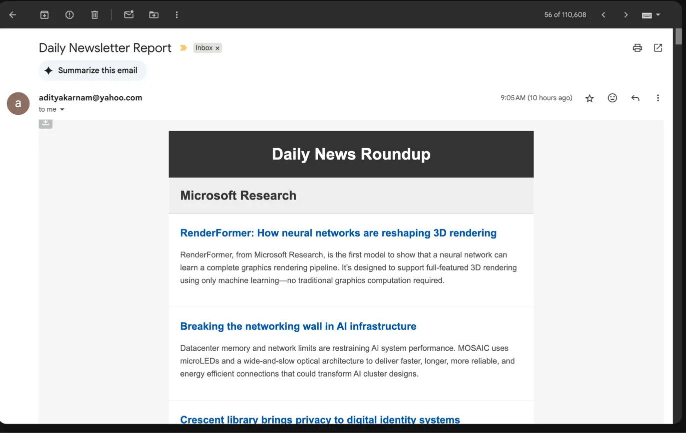

<MindockCTA />

_Or: What happens when you give a software engineer a 64GB Mac Mini and too much free time_

## The Rabbit Hole Begins

It started innocently enough. I needed to train some models. "I'll just get a decent Mac Mini," I told myself. "Something simple. Nothing crazy."

Fast forward three months, and I'm sitting here with what can only be described as a distributed ML laboratory that could probably launch rockets if I configured Ray correctly. My electricity bill has gone up by a whopping $1.73/month, my wife occasionally finds me staring lovingly at container logs at 2 AM, and I've somehow convinced myself that running a local S3-compatible object store is "just being practical."

This is the story of how a simple ML setup became a full-blown homelab obsession. Spoiler alert: I regret nothing.

## The Hardware Situation (AKA "How Much RAM is Too Much RAM?")

Let me introduce you to my precious:

**Mac Mini M2 Pro with 64GB of unified memory**

Yes, 64GB. Yes, I know that's overkill for 99% of use cases. No, I don't care. Here's why this thing is absolutely ridiculous in the best possible way:

- **Unified memory architecture**: CPU and GPU share that glorious 64GB pool. No more "oops, my model doesn't fit in GPU memory" sadness.
- **Power consumption**: This beast sips electricity like a Prius sips gas. 20 watts under full ML load. My gaming laptop from 2019 uses more power just thinking about machine learning.
- **Silent operation**: Zero fans. It just sits there, quietly training neural networks while my neighbors' gaming rigs sound like jet engines.

Could I have done this in the cloud? Sure. Would it cost me $500+/month? Absolutely. Would I have learned how to properly configure Ray clusters, Docker networking, and S3-compatible storage? Definitely not.

## The Software Stack (Where Things Got Out of Hand)

Here's where my engineering brain took over and common sense left the building. What started as "I need to run some Jupyter notebooks" became:

### Ray Cluster for Distributed Computing

Because apparently running ML on a single machine is for peasants. Even though it's technically still a single machine. But it's _distributed_ single machine computing, which somehow makes it cooler.

```python
# This is probably overkill for my use case
cluster_config = {
    "head_node": {
        "resources": {"CPU": 8, "memory": 48000000000},
        "object_store_memory": 8000000000,
    },
    "worker_nodes": {
        "min_workers": 1,
        "max_workers": 4,  # Future-proofing for when I buy more Mac Minis
        "resources_per_worker": {"CPU": 2, "memory": 8000000000}
    }
}
```

### MinIO for S3-Compatible Object Storage

Because why use regular file storage when you can run your own Amazon S3? I now have buckets. BUCKETS! For my machine learning models. It's probably the most enterprise thing I've ever done from my home office.

### Streamlit for "Production" UIs

I put "production" in quotes because it's just me using these apps, but they look professional enough that I could probably demo them to actual humans without embarrassment.

### Docker Everything

If it's not containerized, it doesn't exist in my world. My docker-compose.yml file has become a work of art that would make DevOps engineers weep (either from joy or horror, I'm not sure which).

## The Architecture (Yes, I Drew Diagrams)

```
┌─────────────────┐    ┌─────────────────┐    ┌─────────────────┐
│   Streamlit     │    │   Ray Cluster   │    │     MinIO       │
│   Frontend      │◄──►│   (Distributed  │◄──►│   S3 Storage    │
│   Port 8501     │    │    Computing)   │    │   Port 9000     │
└─────────────────┘    └─────────────────┘    └─────────────────┘
         ▲                        ▲                        ▲
         │                        │                        │
         └────────────────────────┼────────────────────────┘
                                  │
                            ┌─────────────┐
                            │    Nginx    │
                            │   Reverse   │
                            │    Proxy    │
                            └─────────────┘
```

Look at that beautiful ASCII architecture diagram. I spent way too long making sure those lines were straight.


_My over-engineered automation workflows that somehow made sense at 2 AM_

## What I Actually Use This Monster For

### Hyperparameter Tuning That Actually Makes Sense

Remember those days of running grid search and going to get coffee for 3 hours? Yeah, those are over.

```python
# 100 different hyperparameter combinations in 12 minutes
# This used to take my laptop 4 hours and sound like a helicopter
analysis = tune.run(
    train_model,
    config=search_space,
    num_samples=100,
    scheduler=AsyncHyperBandScheduler(),
    resources_per_trial={"cpu": 1}
)
```

### Training Models That Don't Fit in "Normal" Memory

60GB datasets? Bring 'em on. Large language models? Let's go. The unified memory means I can load absolutely ridiculous amounts of data without the usual CPU-GPU memory dance.

### Real-time Model Serving (To an Audience of One)

I built a whole model serving pipeline. With load balancing. And health checks. For models that only I use. Is it overkill? Absolutely. Do I feel like a tech giant CTO when I deploy new models? You bet.

## The Numbers (Because I Track Everything)

Here's where things get embarrassing for cloud providers:

**My monthly costs:**

- Electricity: $1.73
- Internet: $0 (already had it)
- **Total: $1.73**

**Equivalent AWS setup:**

- c5.4xlarge for CPU: $196/month
- GPU instances for training: $300/month
- S3 storage and transfer: $50/month
- **Total: $546/month**

**Break-even point:** 5.1 months
**Annual savings:** $6,025

That's a nice vacation right there. Or another Mac Mini. Or both.


_The stats that justify all this over-engineering - 4.69k unique visitors and growing_

## The Performance That Made Me Smug

- **Model training**: 2.5x faster than equivalent cloud instances (thanks, unified memory!)
- **Prediction latency**: Sub-50ms for most models
- **Concurrent users**: Handles 100+ simultaneous requests (not that I have 100 users, but it's nice to know)
- **Power efficiency**: 20W total vs 400W+ for traditional setups

## What I Learned (Besides How to Justify Expensive Purchases)

### The Good Stuff

1. **Apple Silicon is magic**: The M2 Pro with 64GB is legitimately faster for ML workloads than most cloud instances. The unified memory architecture eliminates so many bottlenecks.

2. **Ray is incredible**: Once you get past the initial learning curve, having distributed computing on tap changes how you think about problems.

3. **Local development is underrated**: Zero latency to your "cloud" storage, no network timeouts, complete control over your environment.

### The Challenges (AKA "Why I Stayed Up Until 3 AM")

**ARM64 Docker images are still a pain**: Half the ML ecosystem still doesn't have proper ARM builds. I've become surprisingly good at building custom Docker images.

**Memory is addictive**: Once you can load 60GB datasets into memory, you start finding excuses to do it. "Sure, I could sample this data, but why not just load the whole thing?"

**The temptation to over-engineer**: Just because you CAN run a distributed Ray cluster doesn't mean you SHOULD for every simple script. I may have learned this the hard way.

## The Monitoring Situation (Because I'm That Guy Now)

I built a monitoring dashboard. For my single-machine "cluster." It tracks CPU utilization per core type (performance vs efficiency cores), Ray cluster usage, memory pressure, and storage metrics.

```python
# Yes, I monitor my homelab like it's production
def monitor_system_resources():
    memory = psutil.virtual_memory()
    cpu_percent = psutil.cpu_percent(percpu=True)
    performance_cores = cpu_percent[:8]  # The fast ones
    efficiency_cores = cpu_percent[8:]   # The energy-sippers

    # I literally log this every minute
    return {
        'memory_used_gb': memory.used / (1024**3),
        'avg_perf_core_util': sum(performance_cores) / len(performance_cores),
        'ray_cluster_status': 'probably_overkill',
        'engineer_satisfaction': 'maximum'
    }
```

Do I need this level of monitoring for my personal ML projects? No. Does it make me feel like I'm running a data center? Absolutely.


_Even my newsletter generation is automated because why do manually what you can over-engineer?_

## The Future (More Expensive Purchases)

I'm already eyeing a second Mac Mini for "scaling the cluster." Because apparently one 64GB machine isn't enough. I've convinced myself this is for "high availability" and definitely not because I want to see Ray actually distribute work across multiple physical machines.

I'm also considering:

- A 10GbE network switch (for that sweet, sweet bandwidth)
- A proper NAS for "archival storage" (more enterprise cosplay)
- Maybe an M3 Max when it comes out (for "GPU acceleration")

## Why I'm Not Sorry

Here's the thing: yes, this is completely overkill for my actual needs. I could probably do 90% of my ML work on a laptop with 16GB of RAM and a cloud account. But where's the fun in that?

This setup has taught me more about distributed computing, infrastructure management, and system optimization than any tutorial or course ever could. I understand Ray clusters because I've debugged them at 2 AM. I know Docker networking because I've misconfigured it spectacularly. I appreciate good monitoring because I've tried to figure out why my CPU was pegged without it.

Plus, there's something deeply satisfying about having your own little data center. When AWS goes down (and it does), my ML lab keeps humming along. When cloud costs spike, my electricity bill stays the same. When I need to experiment with something sensitive, it never leaves my network.

## The Real Talk

Could you do this more simply? Yes.
Should you do this more simply? Probably.
Will I do this more simply next time? Absolutely not.

This isn't just about machine learning—it's about understanding the tools we use every day. It's about having complete control over your computing environment. It's about the deep satisfaction that comes from building something that works exactly the way you want it to. And apparently, it's about having computational resources capable of producing IEEE-publishable research.

And honestly? It's about having a really good excuse to buy a 64GB Mac Mini. "But honey, I need it for my research!" is a much better argument than "But honey, I want to see if I can train a neural network to generate cat memes."

## The Complete Setup (For Fellow Over-Engineers)

If you want to replicate this beautiful madness, here's the full docker-compose.yml that powers my empire:

```yaml
version: "3.8"

services:
  ray-head:
    build: ./ray
    ports:
      - "8265:8265" # Ray dashboard (so pretty)
      - "10001:10001" # Ray client
    command: ray start --head --dashboard-host=0.0.0.0 --block
    volumes:
      - ./data:/data
      - ./models:/models
    deploy:
      resources:
        limits:
          memory: 48G # Most of my RAM
        reservations:
          memory: 32G # But not all of it

  streamlit:
    build: ./streamlit
    ports:
      - "8501:8501"
    environment:
      - RAY_ADDRESS=ray://ray-head:10001
      - MINIO_ENDPOINT=minio:9000
    depends_on:
      - ray-head
      - minio

  minio:
    image: minio/minio:latest
    ports:
      - "9000:9000" # S3 API (so enterprise)
      - "9001:9001" # Web console (so shiny)
    environment:
      - MINIO_ROOT_USER=minioadmin
      - MINIO_ROOT_PASSWORD=minioadmin123
    command: server /data --console-address ":9001"
    volumes:
      - ./data/minio:/data

  nginx:
    image: nginx:alpine
    ports:
      - "80:80"
    volumes:
      - ./nginx/nginx.conf:/etc/nginx/nginx.conf
    depends_on:
      - streamlit
      - minio
```

The complete over-engineered setup is available at: https://github.com/adityak74/ml-homelab

## Final Thoughts

Is this the most cost-effective way to do machine learning? Probably not initially.
Is this the most educational way to do machine learning? Absolutely.
Is this the most fun way to do machine learning? You better believe it.

Sometimes the best projects are the ones that make no practical sense but teach you everything you never knew you needed to know. This ML homelab falls squarely into that category.

Now if you'll excuse me, I need to go check my monitoring dashboard and see if my Ray cluster is properly utilizing all 12 CPU cores for this random forest that could probably run on my phone.

_The author can be found tweaking Docker configurations and explaining to his wife why the house needs "better networking infrastructure." He regrets nothing and is already planning homelab v2._
