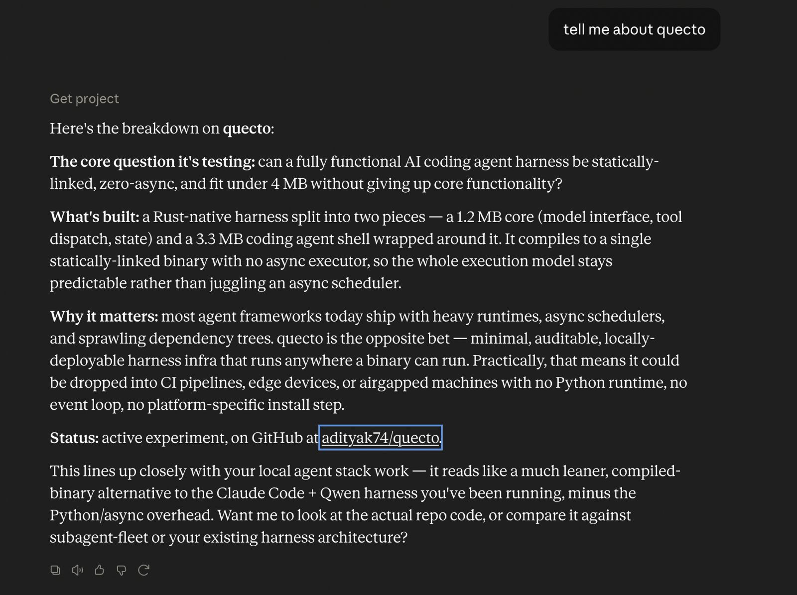
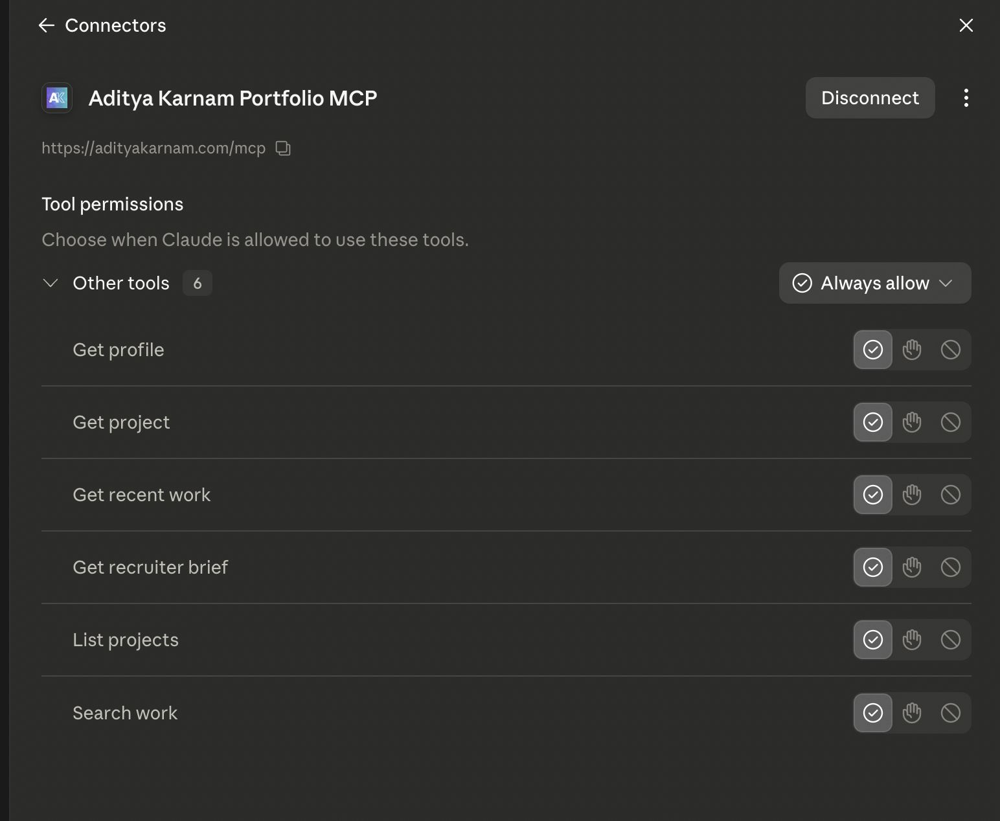
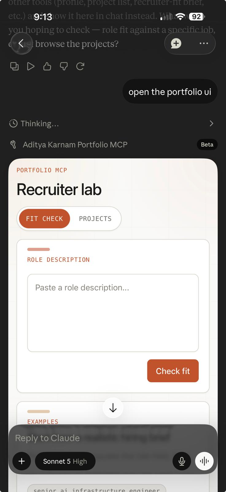

_Yesterday I stopped treating my portfolio as a website that happens to have a "content API" and started treating it as a service AI agents can actually call. adityakarnam.com now runs a hosted [Model Context Protocol](https://modelcontextprotocol.io) server, and on top of it, an interactive app a client like Claude Desktop can render inline._

**TL;DR:** [adityakarnam.com/mcp](https://adityakarnam.com/mcp) is a public, read-only MCP server exposing my projects, recent work, and a recruiter "fit check" as callable tools. On top of it sits an MCP App — a two-tab dashboard (Fit Check + Projects) that renders inside any MCP client without leaving the chat. Install it with `claude mcp add --transport http aditya-portfolio https://adityakarnam.com/mcp`.

This site has been drifting toward "infrastructure lab" for a while — a [hero chat](/) backed by Cloudflare AI Search, a [subagent-fleet](/subagent-fleet-local-ai-compute-control-plane/) control plane, a running [Coding Agent Value Lab](/coding-agent-value-lab/). The MCP server is the next logical piece: instead of a human reading my site, an agent should be able to query it directly — "does this person's background fit this role," "what has he shipped recently," "show me the projects that touch X" — and get structured answers back.

## What Actually Shipped

Three PRs went out in about a day:

- **[#72 — Add hosted portfolio MCP endpoint](https://github.com/adityak74/adityakarnam.com/pull/72):** the server itself.
- **[#74 — Add interactive Portfolio MCP App](https://github.com/adityak74/adityakarnam.com/pull/74):** an iframe-based UI on top of it.
- **[#75 — Restyle Portfolio MCP App](https://github.com/adityak74/adityakarnam.com/pull/75):** made it look like it belongs on the site instead of a bare browser form.

### The Server: `/mcp`

The endpoint is a Cloudflare Pages Function (`functions/mcp.ts`) that handles JSON-RPC over HTTP — no separate backend, no database, just the existing Gatsby deploy plus one function. It exposes seven read-only tools:

- `get_profile` — who I am, in structured form
- `list_projects` / `get_project` — the project catalog, browsable and filterable
- `search_work` / `get_recent_work` — deterministic search across posts, projects, and systems
- `get_recruiter_brief` — paste a role description, get back a fit assessment against my actual background
- `open_portfolio_app` — launches the interactive UI (more on this below)

Discovery is a static manifest at [`/.well-known/aditya-portfolio-mcp.json`](https://adityakarnam.com/.well-known/aditya-portfolio-mcp.json), and there's a plain-language install page at [`/mcp-install/`](https://adityakarnam.com/mcp-install/) for humans who'd rather copy a command than read a spec. If your client speaks MCP natively:

```
claude mcp add --transport http aditya-portfolio https://adityakarnam.com/mcp
```

If it's stdio-only, the `mcp-remote` bridge covers it:

```
npx mcp-remote https://adityakarnam.com/mcp
```

The data scope is intentionally narrow — the manifest states outright what it exposes (public projects, posts, systems, research agenda, source links) and what it never will (private files, email, analytics, availability, compensation, immigration status). It's a portfolio, not a doxxing surface.



Once it's connected, it behaves like any other tool: ask a normal question and Claude reaches for it on its own.



Hardening took more effort than the happy path. The rate limiter is KV-backed and fails open, but the first version never actually wrote to KV — `expirationTtl` was set under Cloudflare's 60-second minimum, so every write silently no-opped. That took a diagnostic-logging pass to catch and fix. Separately, the initial `tools/list` response was missing a required `inputSchema` field, which is a hard requirement of the MCP spec, not an optional nicety — and CORS preflight was rejecting requests before either of those even mattered. All three got fixed before the endpoint went live. Test coverage for this piece: 48 tests across 12 files, plus a manual `wrangler pages dev` smoke pass against the install page, manifest, health check, `tools/list`, and protocol-version rejection.

### The App: Fit Check and Projects, Inline

A JSON-RPC endpoint is useful to an agent but invisible to a human watching the conversation. The MCP App fixes that. Calling `open_portfolio_app` returns a `ui://portfolio-app` resource — a single self-contained HTML bundle (React, built with Vite's single-file plugin, zero external script or stylesheet references) that MCP clients with UI support render as an inline iframe.

Two tabs:

- **Fit Check** — paste a role description, it calls `get_recruiter_brief` live and renders the result as a fit assessment, not a raw JSON blob.
- **Projects** — browse and filter the project catalog via `list_projects` / `get_project`, backed by the same live endpoint the agent tools use.

Every outbound link (project pages, posts, GitHub) routes through the SDK's `app.openLink()` rather than raw iframe navigation, so the host client stays in control of what actually opens. State logic for both tabs lives in pure, independently tested reducers, separate from rendering — which mattered a lot for the second PR, where I wanted to be confident that a full visual restyle touched *only* presentation files and nothing in `bridge.ts`, `protocol.ts`, or the reducers themselves.



The first version worked but looked like a bare HTML form — unstyled inputs, default browser buttons, no relationship to the rest of the site. PR #75 pulled in the actual chrome components from the site's `/systems` and `/stack` pages — the warm cream background with a radial glow and grid overlay, white panel cards with an accent bar, monospace uppercase labels — into a shared `theme.tsx` that the app now builds on. It also added three clickable preset prompts to Fit Check's empty state, so it doesn't read as a blank textbox the first time someone opens it.

## How It Got Built

The pattern for all three PRs was the same, and it's the one I've been leaning on for anything nontrivial on this site lately: write a design spec and implementation plan first (checked into `docs/superpowers/specs/` and `docs/superpowers/plans/`), have Codex execute it task-by-task in an isolated git worktree, then independently verify the diff against the plan — rerun the test suite, rerun the build, and check the things a plan can't fully specify, like "does the generated HTML actually have zero external references." The full app suite sits at 73/73 tests passing across both feature PRs, protocol wiring, bridge parsing, and both reducers.

## Why Bother

A static portfolio site answers one question well: "what does this look like to a human clicking around." An MCP server answers a different one: "can a tool call this and get something structured back." Both matter now. Recruiters and hiring managers are increasingly running agents themselves before they run a search; project collaborators want a quick answer to "has he built anything like this before" without reading six blog posts. Read-only tools plus an inline UI mean either path — programmatic query or a rendered dashboard — hits the same source of truth.

It's live now at [adityakarnam.com/mcp](https://adityakarnam.com/mcp). If you're running Claude Code, Claude Desktop, or anything else that speaks MCP, the install command above gets you the tools and the app in one step.
