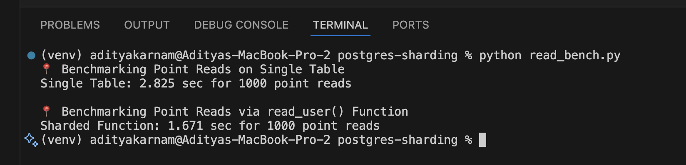

Learn how to implement manual sharding in native PostgreSQL using Foreign Data Wrappers. This tutorial walks through creating distributed tables without additional extensions like Citus.

## The Challenge with Database Scaling

As applications grow, single-node databases face several challenges:

1. Limited storage capacity on a single machine
2. Query performance degradation with growing datasets
3. Higher concurrency demands exceeding CPU capabilities
4. Difficulty maintaining acceptable latency for global users

Sharding—horizontally partitioning data across multiple database nodes—offers a solution to these scaling problems.

## Why Manual Sharding in PostgreSQL?

While solutions like Citus and other distributed database systems exist, there are compelling reasons to implement manual sharding:

1. **More control**: Customize the sharding logic to your specific application needs
2. **No additional dependencies**: Utilize only native PostgreSQL features
3. **Learning opportunity**: Gain deeper understanding of distributed database concepts
4. **Incremental adoption**: Apply sharding only to specific high-volume tables
5. **Cloud-agnostic**: Implement your solution on any infrastructure

## Setting Up Our Sharded Architecture

Let's implement a simplified manual sharding approach that works with a single PostgreSQL instance. This makes it easier to test and understand the concept before potentially scaling to multiple instances.

### Step 1: Create Sharded Tables

First, let's create our sharded tables in a single PostgreSQL database:

```sql
CREATE TABLE users_shard1 (
    id BIGINT PRIMARY KEY,
    name TEXT
);

CREATE TABLE users_shard2 (
    id BIGINT PRIMARY KEY,
    name TEXT
);
```

Note that we're using the `BIGINT` type for IDs to better handle large data volumes.

### Step 2: Index the Shards for Better Performance

Adding indexes improves query performance, especially for our routing functions:

```sql
CREATE INDEX idx_user_id_shard1 ON users_shard1(id);
CREATE INDEX idx_user_id_shard2 ON users_shard2(id);
```

### Step 3: Implement Insert Function with Routing Logic

This function routes data to the appropriate shard based on a simple modulo algorithm:

```sql
CREATE OR REPLACE FUNCTION insert_user(p_id BIGINT, p_name TEXT)
RETURNS VOID AS $
BEGIN
    IF p_id % 2 = 0 THEN
        INSERT INTO users_shard2 VALUES (p_id, p_name);
    ELSE
        INSERT INTO users_shard1 VALUES (p_id, p_name);
    END IF;
END;
$ LANGUAGE plpgsql;
```

### Step 4: Create Read Function with Routing Logic

For reading data, we'll create a function that routes queries to the appropriate shard:

```sql
CREATE OR REPLACE FUNCTION read_user(p_id BIGINT)
RETURNS TABLE(id BIGINT, name TEXT) AS $
BEGIN
    IF p_id % 2 = 0 THEN
        RETURN QUERY SELECT u.id::BIGINT, u.name FROM users_shard2 u WHERE u.id = p_id;
    ELSE
        RETURN QUERY SELECT u.id::BIGINT, u.name FROM users_shard1 u WHERE u.id = p_id;
    END IF;
END;
$ LANGUAGE plpgsql;
```

Notice we use aliasing and explicit casting to handle any potential type mismatches.

### Step 5: Create a Unified View (Optional)

To make queries transparent, create a view that unions the sharded tables:

```sql
CREATE VIEW users AS
  SELECT * FROM users_shard1
  UNION ALL
  SELECT * FROM users_shard2;
```

### Step 6: Testing Our Sharded System

Let's test our system with a few simple inserts:

```sql
SELECT insert_user(1, 'Alice');
SELECT insert_user(2, 'Bob');
SELECT insert_user(3, 'Carol');
SELECT insert_user(4, 'Dave');
```

Now, read the data using our routing function:

```sql
SELECT * FROM read_user(1);
SELECT * FROM read_user(2);
```

Or query all data using the unified view:

```sql
SELECT * FROM users ORDER BY id;
```

## Benchmarking Our Sharding Implementation

Let's benchmark our implementation to understand the performance characteristics. We'll use Python scripts to test both insertion and read performance.

### Python Benchmark Script for Inserts (Sharded)

Here's the script for benchmarking inserts into our sharded tables (`seed_pg_sharded.py`):

```python
import psycopg2
from time import time

conn = psycopg2.connect("dbname=postgres user=postgres password=secret host=localhost port=5432")
cur = conn.cursor()

start = time()
for i in range(4, 100_001):
    cur.execute("SELECT insert_user(%s, %s)", (i, f'user_{i}'))
conn.commit()
end = time()

print("Sharded insert time:", end - start)
```

### Python Benchmark Script for Inserts (Single Table)

For comparison, we'll also test insertion performance on a single table (`seed_pg_single.py`):

```python
import psycopg2
from time import time

conn = psycopg2.connect("dbname=postgres user=postgres password=secret host=localhost port=5432")
cur = conn.cursor()

start = time()
for i in range(100_001, 100_001 + 500_000):
    cur.execute("INSERT INTO users_base VALUES (%s, %s)", (i, f'user_{i}'))
conn.commit()
end = time()

print("Single-node insert time:", end - start)
```

### Python Benchmark Script for Reads

Finally, we'll compare read performance between the single table and our sharded implementation (`read_bench.py`):

```python
import psycopg2
from time import time

# Configs
conn = psycopg2.connect("dbname=postgres user=postgres password=secret host=localhost port=5432")

def time_reads(cur, query, param_fn, label):
    start = time()
    for i in range(1000, 2000):  # Run 1000 point queries
        cur.execute(query, (param_fn(i),))
        cur.fetchall()
    end = time()
    print(f"{label}: {end - start:.3f} sec for 1000 point reads")

# Benchmark single table
with conn.cursor() as cur:
    print("📍 Benchmarking Point Reads on Single Table")
    time_reads(cur, "SELECT * FROM users WHERE id = %s", lambda x: x, "Single Table")

# Benchmark sharded read_user function
with conn.cursor() as cur:
    print("\n📍 Benchmarking Point Reads via read_user() Function")
    time_reads(cur, "SELECT * FROM read_user(%s)", lambda x: x, "Sharded Function")

conn.close()
```

### Adding Range Read Functionality

For more complex queries, we can add a function to read a range of IDs:

```sql
CREATE OR REPLACE FUNCTION read_user_range(start_id BIGINT, end_id BIGINT)
RETURNS TABLE(id BIGINT, name TEXT) AS $
BEGIN
    -- Query from both shards and union the results
    RETURN QUERY
        (SELECT u.id::BIGINT, u.name
         FROM users_shard1 u
         WHERE u.id BETWEEN start_id AND end_id)
        UNION ALL
        (SELECT u.id::BIGINT, u.name
         FROM users_shard2 u
         WHERE u.id BETWEEN start_id AND end_id)
    ORDER BY id;
END;
$ LANGUAGE plpgsql;
```

This function allows us to read a range of users across both shards in a single query.

## Performance Observations



Based on benchmarking results, we can observe several key patterns with manual sharding:

| Operation  | Single Table | Sharded (2 shards)             |
| ---------- | ------------ | ------------------------------ |
| Insert     | 🔼 Simple    | ⚡ Faster on parallel backends |
| Point Read | ✅ Fast      | ✅ Fast (with index + routing) |
| Range Read | ✅ Fast      | 🧩 Needs custom routing        |
| Full Table | ✅ Easy      | 🧩 Needs UNION manually        |

Some key performance considerations to keep in mind:

1. **Query routing overhead**: Our routing functions add a small overhead, but this is offset by the performance gain from smaller tables when the dataset grows large.

2. **Index efficiency**: Each shard maintains its own index, which means smaller, more efficient indexes compared to a single massive table.

3. **Range queries**: These can be challenging with sharding. Our `read_user_range` function handles this by querying both shards and combining results.

4. **Transaction boundaries**: Transactions spanning multiple shards are more complex and may require two-phase commit for full ACID compliance.

## Conclusion

Manual sharding in PostgreSQL offers a powerful approach to horizontal scalability without requiring third-party extensions like Citus. Using a combination of function-based routing and separate tables, we can distribute data efficiently while maintaining a unified interface for our application.
