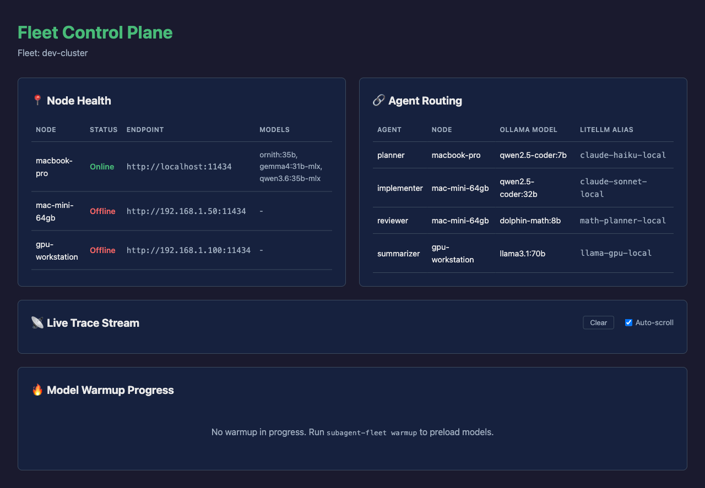

_I built [subagent-fleet](https://github.com/adityak74/subagent-fleet) because my local AI setup had outgrown the single-endpoint mental model. One laptop, one Mac mini, one workstation, and a few Ollama models should behave like a coordinated fleet, not a pile of disconnected machines._

Local LLM development has a strange ceiling. You can have plenty of useful hardware around you: a MacBook for fast planning, a Mac mini with more memory for coding, maybe a GPU workstation for heavier jobs. But most coding-agent setups still ask for one model endpoint.

That is fine for a single chat. It breaks down when you start using subagents.

A planner does not need the same model as an implementer. A reviewer should probably run on a stronger coding model. A summarizer can be cheap and local. A long-running coding session should not silently fail because one Ollama node dropped off the network.

So I built **subagent-fleet**: a local AI compute control plane for Claude Code-style subagents and coding agents.

The project is open source on GitHub:

[github.com/adityak74/subagent-fleet](https://github.com/adityak74/subagent-fleet)

The docs site is here:

[adityak74.github.io/subagent-fleet](https://adityak74.github.io/subagent-fleet/)

## The Core Idea

`subagent-fleet` sits above Ollama and LiteLLM. It does not replace either of them. Instead, it gives you one declarative `fleet.yaml` that describes:

- which machines are in your fleet
- which Ollama models live on each machine
- which coding-agent roles should use which models
- what Claude Code-style agent files should be generated
- how the LiteLLM gateway should route requests

The routing model is intentionally practical:

```text
planner     -> small fast model on a lightweight node
implementer -> larger coding model on a bigger node
reviewer    -> larger coding model on a bigger node
summarizer  -> small local model on the controller
```

That is the whole point. Agent roles are not interchangeable. Their compute should not be either.

## Why I Wanted This

My local AI projects kept converging on the same problem: I had more than one useful machine, but no clean way to treat them as one coding-agent backend.

For example, a local setup might look like this:

```text
Claude Code / coding harness
        |
        v
LiteLLM gateway generated by subagent-fleet
        |
        +-- Ollama node: laptop
        +-- Ollama node: Mac mini 64GB
        +-- Ollama node: workstation
```

Without a control plane, the developer has to remember which model lives where, hand-write proxy config, keep agent definitions in sync, warm models manually, and debug routing by reading logs after something goes wrong.

That becomes tedious quickly.

With `subagent-fleet`, the topology is the source of truth. You define the fleet once, validate it, generate the runtime config, and start working.

## What It Generates

Running:

```bash
subagent-fleet generate
```

creates the glue files that a local coding-agent workflow needs:

```text
litellm_config.yaml
.claude/agents/planner.md
.claude/agents/implementer.md
.claude/agents/reviewer.md
.env.subagent-fleet
```

That means the same `fleet.yaml` can drive both the gateway and the assistant-facing subagent definitions.

Here is the shape of a simple model route:

```yaml
models:
  heavy-coder:
    node: m4-mini-64gb
    ollama_model: qwen2.5-coder:32b
    litellm_alias: claude-sonnet-local
    context: 32768
    timeout: 600
    max_parallel: 1
```

And here is the kind of agent mapping it supports:

```yaml
agents:
  planner:
    model: small-coder
    description: Use for planning, file discovery, task decomposition, and summarization.
    tools: [Read, Grep, Glob]

  implementer:
    model: heavy-coder
    description: Use for implementation, bug fixes, refactors, and patch creation.
    tools: [Read, Grep, Glob, Edit, MultiEdit, Bash]

  reviewer:
    model: heavy-coder
    description: Use after implementation to review diffs, tests, regressions, and maintainability.
    tools: [Read, Grep, Glob, Bash]
```

This is where the tool becomes useful: it turns role design into infrastructure.

## The Dashboard

The part I care about most is visibility. Local model infrastructure often fails in boring ways: a node is asleep, an endpoint moved, a model is cold, a proxy route is wrong, or a request is hanging behind a loaded machine.

`subagent-fleet ui` opens a live dashboard at `http://localhost:8080` that streams fleet state over SSE.



The dashboard shows:

- **Node Health**: which Ollama nodes are online and which models they expose
- **Agent Routing**: which role maps to which model and machine
- **Live Trace Stream**: LiteLLM logs as they happen
- **Warmup Progress**: model preload status before a coding session

This sounds operational, and that is the point. Once agents start doing real work, you need observability. Otherwise, you are just hoping the right local model answered.

## Model Warmup Matters

One of the small but painful issues in local LLM workflows is cold startup time. The first request to a model can be slow enough to make the whole system feel unreliable.

`subagent-fleet warmup` preloads configured Ollama models before the session starts. The dashboard tracks warmup progress, so you can see which models are ready and which ones still need attention.

That small detail changes the feel of the workflow. Instead of waiting for the first planner or implementer call to pay the load penalty, the fleet gets prepared upfront.

## Built for Private Local Networks

This is not a hosted SaaS control plane. It assumes your machines are on a private network: LAN, Tailscale, WireGuard, or a private subnet.

The security model is deliberately conservative:

- do not expose Ollama directly to the public internet
- do not expose LiteLLM without authentication
- keep generated environment files local
- set `LITELLM_MASTER_KEY` for gateway access

The project is meant for developers who want more control over their local AI compute, not for turning a home network into a public inference service.

## The Current Release

The current control-plane release is `v0.2.0`. The CLI includes:

```bash
subagent-fleet init
subagent-fleet validate
subagent-fleet discover
subagent-fleet generate
subagent-fleet warmup
subagent-fleet status
subagent-fleet doctor
subagent-fleet clean
subagent-fleet ui
subagent-fleet trace
subagent-fleet skills list
subagent-fleet skills install
subagent-fleet plugins install
```

Install it from PyPI:

```bash
python -m pip install subagent-fleet
```

Or with `pipx`:

```bash
pipx install subagent-fleet
```

Then start with:

```bash
subagent-fleet init
subagent-fleet validate
subagent-fleet discover
subagent-fleet generate
subagent-fleet ui --config fleet.yaml
```

## Why This Is More Than a Config Generator

The deeper reason I built this is that coding agents are starting to look less like one assistant and more like a runtime.

Once you have planners, implementers, reviewers, summarizers, security checkers, documentation agents, and test generators, the question becomes: where should each role run?

The answer should depend on capability, latency, memory, availability, and cost. A fast local model is good enough for decomposition. A larger coding model is better for implementation. A separate reviewer role should have its own constraints. If a node goes offline, the system should make that obvious immediately.

That is what `subagent-fleet` is trying to make concrete: local agent infrastructure that is inspectable, reproducible, and role-aware.

## What I Want to Explore Next

The roadmap is still evolving, but the direction is clear:

- richer routing policies for fallback and load-aware selection
- better runtime traces across multi-agent sessions
- tighter Claude Code and Codex plugin flows
- more examples for laptop-only, Mac mini, and multi-node clusters
- stronger eval coverage against real local fleets

The project already ships with examples, generated plugin artifacts, assistant skills, and a dashboard. The next step is making the control plane smarter without making it harder to operate.

## Closing Thought

Local AI is not just about running one model on one machine. For serious coding-agent workflows, local AI starts to look like infrastructure.

`subagent-fleet` is my attempt to make that infrastructure practical: one config, one gateway, role-aware subagents, warm models, visible routing, and a dashboard that tells you what is actually happening.

If you run Ollama on more than one machine, or if you are experimenting with Claude Code-style subagents, try it:

[github.com/adityak74/subagent-fleet](https://github.com/adityak74/subagent-fleet)

[adityak74.github.io/subagent-fleet](https://adityak74.github.io/subagent-fleet/)
