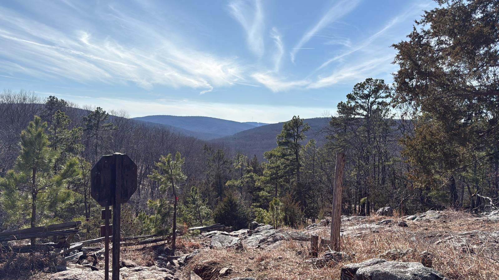

<MindockCTA />

Every social media feed is filled with people conquering mountains. Someone is scaling Everest, another person is posting perfect yoga poses on cliff edges, and someone else is meditating at sunrise on a pristine summit. Meanwhile, I'm contemplating a simple hike to Mina Sauk Falls near Ironton, Missouri, on Chaitra Purnima, wondering if my journey carries any significance at all.

Today, as millions across India celebrate Hanuman Jayanti, I decided to embark on my own pilgrimage – a solo hike that would test my resolve in ways I hadn't anticipated.

## What is Hanuman Jayanti?

For those unfamiliar, today marks the celebration of Lord Hanuman's birth, observed on the full moon day (Purnima) in the Hindu month of Chaitra. This year, it falls on Saturday, April 12, 2025.

Lord Hanuman embodies unwavering devotion, extraordinary strength, and selfless service. He's the loyal devotee of Lord Rama, whose adventures in the epic Ramayana have inspired Hindus for millennia. Hanuman is not just any deity – he's the one we turn to when facing seemingly insurmountable obstacles.

Across India, devotees are visiting temples, reciting the Hanuman Chalisa, and offering prayers. Some observe fasts, others participate in elaborate rituals. But the essence remains the same – connecting with the divine energy of courage and devotion that Hanuman represents.

## The Symbolism of the Climb

The internet wants you to believe that spiritual journeys must be Instagram-worthy—exotic, extreme, photogenic. But what if I told you that a humble hike to Mina Sauk Falls on Hanuman Jayanti contains more spiritual power than a thousand viral posts?

This climb isn't about competing with others' spiritual experiences. It's about connecting with something eternal that flows beneath us all.

Social approval exists to attract participants in a game that ultimately benefits the collective at the expense of an individual. You can be smarter. You can turn the game around.

When I stepped onto that trail leading to Mina Sauk Falls, I wasn't participating in a spiritual competition. I was engaging in a practice that transforms from within.

Each step isn't about proving anything to anyone. It's about embodying the values Hanuman represents—devotion, courage, and selfless service. What society celebrates are the extraordinary feats, the record-breaking spiritual stunts. But Hanuman's true power came from his unwavering focus on serving Rama, not from seeking acclaim for his abilities.

## My Journey to Mina Sauk Falls

Though I had hiked this trail six times before, always with companions, this time was different. This was my first solo hike, and somehow that made all the difference. The Mina Sauk Falls trail is a loop of about 2.9 miles with red trail blazes, containing Missouri's highest waterfall cascading 132 feet over volcanic rock.

What made this experience unique was not just being alone with my thoughts, but the parallel journey I was taking – both physically through the Missouri wilderness and spiritually in celebration of Hanuman Jayanti.

The trail begins with an unexpected initial descent. As I made my way down, I found myself navigating a rocky path with countless stones underfoot, carved by flowing water over time. In the distance, I could hear the faint sound of flowing water – my destination calling to me, yet still far away. The only thing to do was keep moving forward and following the path.

There's something philosophical in that initial descent that resonates with Hanuman's story. Sometimes our paths to greatness begin not with immediate ascent but with humble steps downward. Just as Hanuman first had to humble himself before serving Rama, sometimes we must first descend before we can truly rise.

As the path leveled out, with fewer stones and more comfortable footing, I found myself able to breathe more deeply and take in my surroundings. This middle section of the trail reminded me of those moments in life when the storm of thoughts and experiences temporarily subsides, allowing us to see ourselves more clearly. It's in these pauses that we can examine our path, become aware of our surroundings, and plan our next steps – physically moving forward while mentally preparing for what lies ahead.

## Reaching Beyond Limits: The Final Ascent

Just as I was settling into this comfortable rhythm, the final challenge presented itself – a steep, rocky ascent to reach Mina Sauk Falls. Looking up at those massive rocks staring down at me, I couldn't help but think of the fears and insecurities that often block our paths in life.

This was the point where I had always stopped in my previous six attempts. The rocks had always seemed too intimidating, the climb too difficult. But today was Hanuman Jayanti – a day dedicated to the deity who leapt across oceans and moved mountains. If there was ever a day to push beyond my limitations, this was it.

As a child, Hanuman saw the rising sun and mistook it for a ripe fruit. Without hesitation, he leapt into the sky to grasp it. Think about that for a moment. While most of us squint and shield our eyes from the sun's brilliance, young Hanuman's instinct was to reach for it. To consume it. To make its power his own.

This isn't just a charming mythological anecdote. It's a profound metaphor for the spiritual journey I was undertaking, one step at a time.

The sun represents prakriti—the material nature that gives life to everything. It's the source of energy, growth, and vitality. It's also the source of the seasons, of time itself, of mortality. To reach for the sun is to reach beyond the ordinary constraints of existence.

Most spiritual paths ask us to accept our limitations. To make peace with the boundaries of life and death. But Hanuman shows us another possibility—the courage to transcend those boundaries. The audacity to swallow the source of creation itself.

With this inspiration, I began my ascent, taking it one step at a time. My hiking shoes were struggling with the terrain, but the hilltop and the sounds of the falls pulled me upward with almost magnetic force. I made a conscious decision not to stop, not even for a second, knowing that the slightest pause might weaken my resolve and derail my motivation.

When prakriti is conquered, what is left to fear?

My breath grew shorter as the trail steepened. My legs ached with effort. This was prakriti asserting itself—my body reminding me of its needs and limits. But something inside pushed forward anyway. Something reached beyond the limitations of flesh and bone. That something was the same divine spark that allowed a child god to leap for the sun.

## The Summit: Mina Sauk Falls

And then, finally, after clearing the last rock, I stood at the top, breathing heavily but triumphant. The serene sound of water flowing downward filled my ears, and nothing else mattered. Located in the St. Francois Mountains in the Ozarks of Southeastern Missouri, Mina Sauk Falls is the highest waterfall in Missouri, falling 132 feet over volcanic rock.

By the time I reached the falls, sweating and triumphant, I had reenacted Hanuman's primordial leap in my own small way. I had risen above the pull of gravity, above the voice that whispered I couldn't make it. I had tasted, if only for a moment, what it means to swallow the sun.

<LazyVideo src="/videos/SOUND_OF_WATER.mp4" poster="/banner-aditya.png" />

<LazyVideo src="/videos/SOUND_OF_WATER_2.mp4" poster="/banner-aditya.png" />

## The View from Above

After catching my breath at the falls, I stepped back to admire the view. The world below looked different from up here. The perspective gained at this summit brought clarity similar to what Hanuman must have experienced during his legendary leaps. The insurmountable became surmountable.

This change in perspective is precisely why climbing has been part of spiritual practice across cultures. When you rise above the ordinary level of existence, you see things differently. Problems that loomed large in your mind now appear manageable. The urgent concerns of daily life take their proper place in the grand scheme of things.

Your hike offers a taste of this perspective. From here, you can see farther, broader, clearer. You understand, if only for a moment, what Hanuman might have seen as he soared through the sky on his missions of devotion and courage.

## Returning to the World

As I completed the loop trail and returned to the starting point, I paused and looked back at the path I'd traveled. I had returned to the world of traffic and notifications, deadlines and distractions.

But I hadn't returned unchanged.

The physical exertion had released endorphins, creating a natural high. The ritual of hiking on Hanuman Jayanti had connected me to generations of devotees who've performed pilgrimages on this sacred day. The elevation had given me a new perspective on my daily concerns.

Most importantly, I had embodied, in my small human way, the qualities that make Hanuman so beloved—devotion, courage, determination, service. I didn't just worship these qualities; I practiced them with every step of my climb.

This is why physical pilgrimages remain powerful in our digital age. Reading about devotion is one thing. Experiencing it in your muscles and breath is another entirely. The Hindu tradition has always understood this, integrating physical practices with philosophical wisdom.

## The Everyday Hanuman

As I drove home, I passed countless small roadside shrines. Once, I might have barely noticed them. Now, each one felt like a waypoint, a reminder of my journey.

The true miracle of Hanuman isn't that he could fly or lift mountains. It's that his divine qualities can manifest in ordinary lives, including yours. The tech professional debugging code with tireless persistence. The parent staying up all night with a sick child. The activist fighting against overwhelming odds for justice. The friend who shows up reliably in times of need. All are embodying aspects of Hanuman's spirit.

My hike today wasn't just a one-time event. It was practice for recognizing and scaling the mountains I face every day. For leaping across the oceans of doubt. For carrying burdens that seem too heavy. For serving with a heart full of devotion rather than expectation.

The next time I face an obstacle that seems insurmountable, I'll remember how it felt to reach Mina Sauk Falls after six failed attempts. I'll remember that I have within me the same spark that allowed a monkey god to mistake the sun for a fruit and reach for it without hesitation.

Remember that conquering prakriti—both external nature and your own internal nature—begins with a single step upward.

Jai Hanuman!
