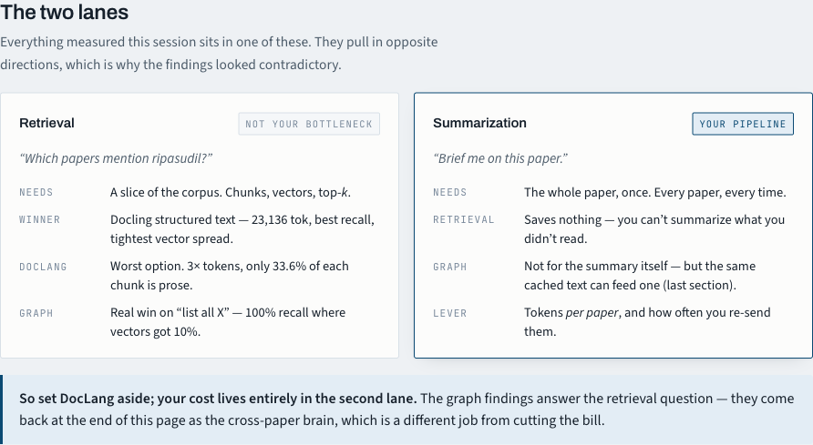
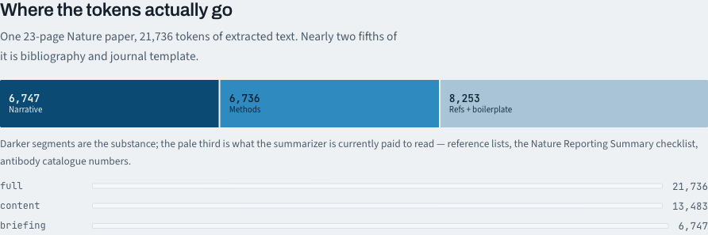
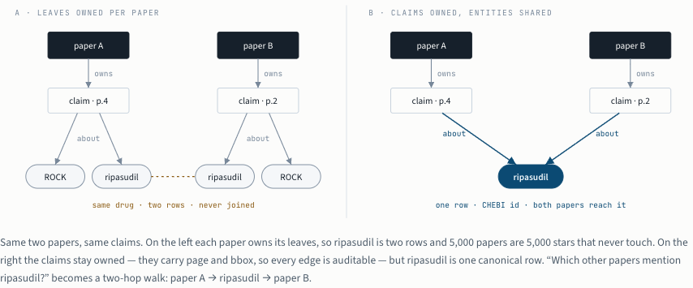

**I spent an evening finding out what it actually costs to feed a research
paper to a language model, and whether [DocLang](https://github.com/doclang-project/doclang)
— the new "AI-native markup for documents" — earns its place in that
pipeline.** Short version: DocLang is a real format with a real idea in it, but
it belongs upstream of the embedder, never inside the vector. On a stock
tokenizer it costs 2.7× markdown for the same paper. The cheapest, cleanest
input I measured was [docling](https://github.com/docling-project/docling)'s
structured text with the bibliography and journal template cut out — 13,483
tokens for a paper whose raw PDF extraction was 27,856.

Every number below is measured, not estimated. The test documents were a
23-page Nature paper
([_A multi-agent system for automating scientific discovery_](https://doi.org/10.1038/s41586-026-10652-y),
17.8 MB) and, as a second data point, the 8-page
[Docling technical report](https://arxiv.org/abs/2501.17887) from arXiv.

## Why I cared

I run a small paper-briefing pipeline on the side. It takes arXiv and journal
PDFs, sends the link to OpenRouter, lets a free DeepSeek R1 model summarize
the paper, and stores the summary in Hasura. It works, and on a free model it
is invisible how wasteful it is. The moment I thought about switching the
summarizer to Claude or GPT, the question became: how many tokens am I paying
for per paper, and how many of them are doing anything?

DocLang showed up in my feed the same week, pitched as the format that "maps
cleanly to LLM tokens while preserving structure, semantics, layout, and
geometry." That sounded like exactly the thing, so I tested it.

## What DocLang actually is

Not an embedding format. It is an XML-like markup language (Apache-2.0, under
LF AI & Data). The `doclang` package on PyPI is `lxml` plus `typer`: a spec, an
XSD, Schematron rules, and a packager. No ML, no PDF parsing. The parsing is
docling's job; DocLang is one of docling's serializers:

```text
PDF --docling--> DoclingDocument --docling_core.serializer.doclang--> .dclg --doclang pack--> .dclx
```

The interesting part is how it encodes geometry. There are no vectors
anywhere. DocLang writes layout position **directly into the tokenizer's
vocabulary**. Each bounding box is normalized to the page, scaled by a
resolution (default 512), rounded, and emitted as `<location value="N"/>`,
which the spec intends to be one literal vocab token. A bbox is four of them.

The spec is explicit about the trade-off: one token per concrete value for
frequent elements (`<location>` burns 512 vocab slots), split tokens for rare
ones like thread ids, to cap vocabulary growth. Total special vocabulary is
617 tokens: 105 structural plus 512 location.

Converting the Nature paper took 55.4 seconds on CPU and produced a 279 KB
`.dclg` that passed XSD and Schematron validation. It contained 4,852
`<location>` elements, which is 63% of all structural tokens in the file.

## The token bill depends on who reads it

I counted the same document four ways with tiktoken's `o200k_base`, once as
a stock model would see it and once assuming DocLang's 617 special tokens
were in the vocabulary.

| What you feed the model                             | Tokens     | vs markdown |
| --------------------------------------------------- | ---------- | ----------- |
| Markdown (docling export)                           | **21,922** | 1.0×        |
| `.dclg`, locations stripped, stock tokenizer        | 31,794     | 1.45×       |
| `.dclg`, default, **stock tokenizer**               | **60,099** | 2.74×       |
| `.dclg`, default, DocLang-aware tokenizer           | 31,979     | 1.46×       |
| PDF as 23 page images (`w×h/750` at 144 dpi)        | ~59,457    | 2.71×       |

**DocLang's efficiency is conditional on the tokenizer.** Claude, GPT, and
every off-the-shelf model tokenize `<location value="34"/>` as roughly eight
plain-text tokens, not one. The same file costs either 32K or 60K depending on
who reads it, and nobody ships the DocLang vocabulary today. Even with the
vocabulary, it is still 1.46× markdown, because the structural tags are real
content the model has to attend over.

## What happens to the figures

The default image mode is `PLACEHOLDER`: the Nature paper's 15 figures come
through as `<picture>` elements with a bbox and no pixels. Text _inside_ the
figures survives, though. Every label, panel letter, and box caption is a
nested `<text>` with its own coordinates: 796 fragments across 15 figures,
and 62 from Figure 1 alone. A model can partially reconstruct a figure from
that without ever seeing it.

| Image mode              | File size            | Tokens         |
| ----------------------- | -------------------- | -------------- |
| `PLACEHOLDER` (default) | 279 KB               | ~32K           |
| `EMBEDDED` (base64)     | 6.2 MB               | **~1,578,000** |
| `REFERENCED` (external) | 281 KB plus 15 PNGs  | ~32K           |

Base64 pixels cost 47× the markup. Non-starter for a text model.

Packaging to `.dclx` is plain OPC, the same ZIP convention as `.docx`. Two
things bit me, and both were real fixes rather than workarounds:

1. **Asset directory name.** The packer copies the contents of whatever you
   pass as `--assets` into `assets/` unconditionally, so the serializer has to
   write `image_dir=Path("assets")` or every `<src>` dangles after packing.
2. **Namespace.** `doclang pack --validate` fails with "No matching global
   declaration available for the validation root" unless you serialize with
   `DocLangParams(include_namespace=True)`. The `validate` command has an
   `--allow-empty-namespace` flag; `pack` does not.

After both, a small verifier confirmed 15 `<src>` references, 0 dangling, 0
orphans.

## The retrieval test: PDF vs DocLang vs docling text

This was the question I actually started with: if I am building embeddings
over papers, should the vector see DocLang? I built three indexes over the
same document with the same model (`all-MiniLM-L6-v2`), the same 512-token
window, and the same eight questions.

| Index                  | Raw PDF text | DocLang markup | Docling text |
| ---------------------- | ------------ | -------------- | ------------ |
| Chunks (vectors)       | 55           | 154            | 74           |
| Tokens indexed         | 27,856       | **70,535**     | **23,136**   |
| Prose share of a chunk | 100%         | **33.6%**      | 100%         |
| Recall@3               | 6/8          | 6/8            | **7/8**      |
| Mean pairwise cosine   | 0.460        | 0.446          | **0.291**    |

Lower mean cosine is better: it means the chunks sit further apart in the
space and are easier to tell apart.

**Raw PDF and DocLang tie on recall for opposite reasons.** The raw PDF text
from `pypdfium2` has correct reading order (it handles the two-column layout
fine) but is dirty: 9 running heads like `Nature | Vol 655` landed
mid-chunk, 110 glyphs came through broken (`ques￾tion`), and fixed
512-token striding cuts across section boundaries, so every chunk is a mush
of several topics and they all look alike. That is the 0.460.

DocLang fails on dilution. Its chunks are clean and correctly bounded, but
only a third of each window is content. Two thirds of the embedding budget
goes to `<location value="34"/>` tokens the model has no representation
for, and the shared markup vocabulary drags every vector toward a common
direction.

Docling's structured text, chunked with its `HybridChunker`, wins all three
axes: fewest tokens, fewest vectors, and the best-separated space. And the
intuition that you need DocLang _in_ the vector to get page citations back
is wrong. Page and bbox come back as chunk metadata:

```json
{
  "text": "…",
  "headings": ["Robin expedites hypothesis generation"],
  "prov": [{ "page": 3, "bbox": [34.0, 422.1, 255.3, 462.8] }]
}
```

That is from the index that embedded zero location tokens. Geometry belongs
in the payload next to the vector, not inside it.

**Ordering for retrieval: docling text > raw PDF > DocLang markup.**

## Then I realized retrieval was not my bottleneck

Everything above answers "which papers mention ripasudil?" That is not what
my pipeline does. My pipeline does "brief me on this paper," for every paper,
every time. You cannot summarize what you did not read, so retrieval saves
nothing there. The only lever in that lane is tokens per paper, and how often
you re-send them.



Once I separated the two lanes the findings stopped looking contradictory.
DocLang was never going to help lane two either, so I set it aside and
started counting where the summarizer's tokens go.

## Where the tokens actually go

Docling gives every text item a section heading and a provenance, so I built
a section graph straight from the `DoclingDocument` (no `.dclg` round trip,
no graph library, about 60 lines) and classified sections by heading name.



Nearly two fifths of the paper is bibliography and journal template: the
reference list, the Nature Reporting Summary checklist, antibody catalogue
numbers, data and code availability statements. The summarizer is currently
paid to read all of it.

| Profile                  | Nature paper (23 pp) | Docling report (8 pp) |
| ------------------------ | -------------------- | --------------------- |
| Full extracted text      | 21,736               | 8,595                 |
| `content` (drop refs and boilerplate) | **13,483** (−38%) | **6,600** (−23%) |
| `briefing` (also drop procedural methods) | 6,747          | —                     |

Per 1,000 papers, using the measured ratios from the retrieval test for the
other formats:

| Input format               | Tokens per 1,000 Nature-sized papers | vs best |
| -------------------------- | ------------------------------------ | ------- |
| Docling text, `content`    | 13.5M                                | 1.00×   |
| Docling text, all          | 21.7M                                | 1.61×   |
| Raw PDF text               | 26.2M                                | 1.94×   |
| DocLang markup             | 66.3M                                | 4.91×   |

One caution on the aggressive profile. `briefing` over-trims: it drops
"Validation of the Robin architecture," which is a results section and
exactly the did-it-actually-work evidence a briefing needs. Name-based
filtering cannot tell that apart from "Robin validation" in the methods. I am
shipping `content` and leaving `briefing` off until it is a classifier rather
than a regex.

## Can retrieval replace the section filter for summarization?

I checked, because "aspect RAG" is the obvious counter-proposal: embed the
chunks, ask six aspect questions (contribution, results, method, limitations,
application, validation), and stitch the top hits into a context. At equal
budget it loses.

| Strategy                                | Tokens | Facts covered |
| --------------------------------------- | ------ | ------------- |
| Full document                           | 21,736 | 10/10         |
| Section filter, `content`               | 13,483 | 10/10         |
| Section filter, narrative only          | 8,334  | 10/10         |
| Aspect RAG, top-5 × 6 aspects (19 chunks) | 4,625 | 7/10          |

The ten facts are things any faithful briefing of that paper must contain:
the disease, the drug, the time saving, the three agent names, the assay, the
target, the cell model, and a stated limitation. Aspect RAG at any `k` missed
the same three: the drug, the target, and the limitation. Cheap, but you
would ship a briefing that never names the compound the paper is about.

## The "list all X" result

The one place vector search fell over completely was aggregative questions.
"Every named agent in the system." "All drugs or compounds tested." "All
statistical tests reported." These are not top-k questions; the answer is
spread across dozens of items, and a five-chunk context catches a handful.
Walking the section graph and filtering items is complete by construction.

| Nature paper, 5 queries, 122 ground-truth items | Recall     | Tokens | % of full |
| ------------------------------------------------ | ---------- | ------ | --------- |
| Vector top-5                                     | 12/122     | 7,730  | 36%       |
| Hierarchical (rank headings, expand top-6)       | 30/122     | 19,847 | 91%       |
| Graph scan and filter                            | **122/122** | 19,357 | 89%      |

On the shorter Docling report the graph scan hit 35/35 at 44% of the
document's tokens, versus 18/35 for vector top-5 at 71%. The pattern held on
both papers: for "every" questions, structure beats similarity, and it is
not close.

## What I am changing in the pipeline

In order. The first two are structural; the last two multiply against them.

1. **Extract once and cache the text.** Today the PDF link goes straight
   through to OpenRouter and gets re-extracted server-side on every retry, up
   to five times. On a free model that is invisible. On a paid model, one
   flaky paper bills several full reads for zero output. Caching the extracted
   text in Hasura kills the multiplier and also lets me A/B Claude, GPT, and
   Kimi on identical input.
2. **Extract with docling, `do_ocr=False`.** arXiv and journal PDFs are
   born-digital, so OCR is the slow stage and buys nothing. Turning it off
   took conversion from 55.4 s to 10.9 s per paper, and the output has 0
   broken glyphs and 0 running heads versus 110 and 9 from the cheap
   server-side extractor. That alone is 22% fewer tokens.
3. **Drop references and journal boilerplate.** The `content` profile. 38%
   off the Nature paper, 23% off the arXiv one.
4. **Gate on relevancy before spending premium tokens.** I already score
   papers cheaply; promote only the top slice to a strong model and keep the
   free tier as tier one.

Three things that will bite, so I am writing them down:

- **On the free model, none of this buys throughput.** The daily quota counts
  requests, not tokens, and DeepSeek R1 free bills nothing per token. Halving
  tokens processes exactly the same number of papers. These savings only
  become money when I switch models.
- **Output tokens become the floor.** Summaries run 500 to 1,000 output
  tokens, and premium models charge a multiple for output. Input is about 90%
  of the bill today; after filtering it is about 68%. Past that, trimming
  input further stops mattering, so I am not going to over-engineer the
  filter.
- **A regex from two papers will not survive thousands of venues.** Section
  names vary. The right version classifies sections rather than matching
  heading strings, and logs every dropped section so mistakes are visible
  instead of silent.

## The cross-paper brain, sketched

The graph results answer a different question than the token bill, but they
point at what the pipeline could become once the extracted text is cached:
one strong-model call for the summary, and a second cheap-model call over
the same cached text to pull entities and claims with page and bbox.


The schema detail I got wrong on the first pass: entities have to be shared
across the corpus, not owned by the paper. If each paper owns its leaves,
ripasudil is two rows in two papers and 5,000 papers are 5,000 stars that
never touch. Keep the claims owned (they carry page and bbox, so every edge
is auditable), but make the entity one canonical row that both papers reach.
"Which other papers mention ripasudil?" becomes a two-hop walk.



Two gates before I build any of it: am I on a paid model yet (otherwise none
of the dollar math applies), and do I have five real queries the graph
answers that vectors cannot? Cache and filter now. Build the graph the day the
first query shows up.

## One gotcha worth knowing

Docling's `HybridChunker` can emit chunks that overflow the embedding window.
Its token counter does include the heading prefix, but a table cannot be
split below the budget; it serializes as one unit and passes through
oversized. At the default `max_tokens=256` one table chunk came out at 267
tokens and would have been silently truncated at embed time, losing its tail
from the index. Size the chunker to the model's real window (512 for MiniLM)
and assert on it:

```python
n_tok = [len(tok.encode(r["text"], add_special_tokens=True)) for r in rows]
assert not [i for i, n in enumerate(n_tok) if n > WINDOW], "chunks would be truncated"
```

## Caveats

- Two papers, 8 retrieval queries on one and 5 aggregative queries on each,
  one small embedder (`all-MiniLM-L6-v2`, 384-dim). The recall spread of 6 vs
  7 is within noise at this N. The token and cosine gaps are not.
- All three retrieval arms missed the same question ("what drug did the
  system identify?" → ripasudil, which appears 27 times). That is an embedder
  limitation, not a format one.
- Token counts use `o200k_base` for the format comparison and the MiniLM
  tokenizer for the pipeline numbers. Claude's tokenizer differs; the ratios
  hold, absolutes shift a few percent.
- The page-image figure is the standard `w×h/750` rule of thumb, not a
  measurement.

## Versions

`doclang` 0.7.3, `docling` 2.124.0, `docling-core` 2.93.0, `pypdfium2` 5.13.0,
`tiktoken` 0.14.0, `torch` 2.13.0, all on CPU on an Apple Silicon Mac. The
experiment was about a dozen short scripts: convert, count, chunk, embed,
three-way compare, section graph, aggregative query test, and the corpus cost
model. If DocLang ships a tokenizer extension that a hosted model actually
uses, the 2.74× number is the one to re-run first.
