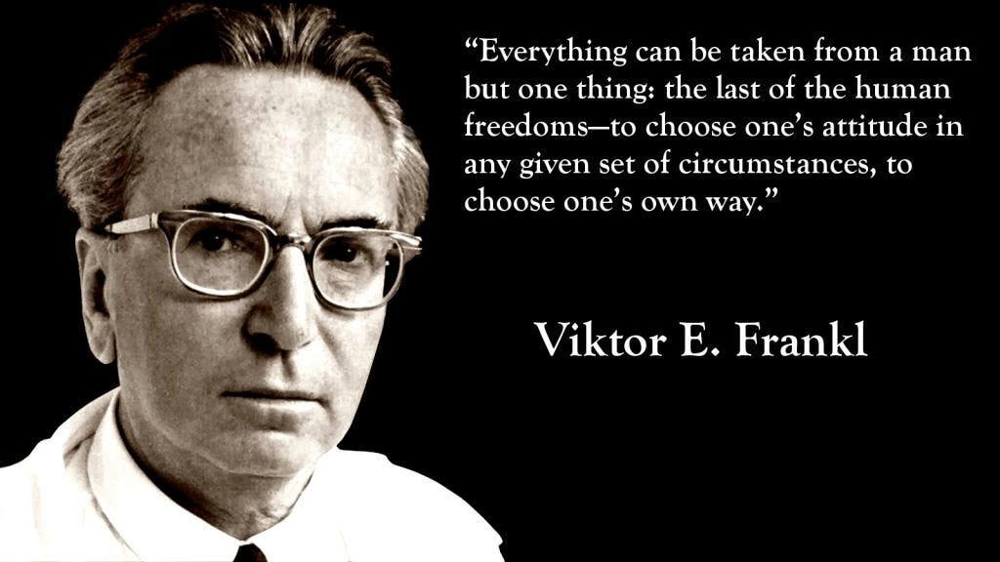

<MindockCTA />

**Why am I writing this**

<h1 style={{color: '#1a202c', fontSize: '32px', fontWeight: 'bold', margin: '16px 0'}}>I've been thinking about all the ways we search for meaning in the wrong places.</h1>

In today's hyper-connected world, we're drowning in information but starving for meaning. Many of us feel a creeping sense of emptiness: *What am I here for? What's the point?* Science explains the mechanics of life but rarely tells us *why* it matters.

There's a name for this: **meaning debt**.  
And it's way more expensive than we think.

I've found that ancient philosophers had a simple, proven approach that supports **authentic living** and **purposeful action**.

**The Radical Truth:** Meaning isn't something you discover—it's something you create.

**1 Insight**

<h1 style={{color: '#1a202c', fontSize: '32px', fontWeight: 'bold', margin: '16px 0'}}>Meaning debt is the cost of not facing what's already true.</h1>

When you don't reflect, don't question, don't examine—  
You end up living the same meaningless patterns over and over again.  
In your career. Your habits. Your relationships. Your purpose.

It's like emotional and spiritual clutter.  
You can ignore it, but it still takes up space.

**1 Habit**

<h1 style={{color: '#1a202c', fontSize: '32px', fontWeight: 'bold', margin: '16px 0'}}>Here's how I've been applying this in a smaller, more personal way:</h1>

🧠 **The "Seen & Said" Vault**  
Every week, I jot down two things:

• **Something I saw clearly** (a pattern, a reaction, a truth I've been avoiding)  
• **Something I said out loud** (a decision, boundary, or belief I want to remember)

Over time, this builds a personal wisdom base.  
Your version could be:

• A voice note after tough days  
• A Google Doc with things you no longer believe  
• A note labeled "lessons paid for"

It doesn't matter how. It just matters that you **don't keep paying the same cost**.

**1 Story**

<h1 style={{color: '#1a202c', fontSize: '32px', fontWeight: 'bold', margin: '16px 0'}}>At the concentration camps, Viktor Frankl discovered something extraordinary about human nature.</h1>

Holocaust survivor and psychiatrist Viktor Frankl observed that while despair consumed most prisoners, a few gave away their last piece of bread, smiled despite hunger, or showed kindness when cruelty was everywhere. 

What set them apart wasn't their circumstances—it was their **choice to create meaning** even in the darkest moments.

Frankl realized that even in suffering, meaning could be chosen: **every moment was an opportunity. Every decision was analyzed. Every choice was logged.**

His enduring message: *"The meaning of life is to give life meaning."*

**That's it for this week!!**

Meaning debt doesn't just slow your growth.  
It slows you.

And the fastest way to move forward?

**Remember what you already learned.**

The Stoics knew this 2,000 years ago:

• **Seneca asked:** "Why do you postpone yourself?"  
• **Marcus Aurelius warned:** "You'd rather be good tomorrow than be good today"  
• **Epictetus taught:** "We are all gods dragging around a little corpse"

You can't control your height, genes, or mortality.  
But you can choose to be fully honest, deeply kind, or unwaveringly just.

**The choice is yours—right now.**

